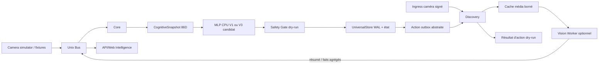
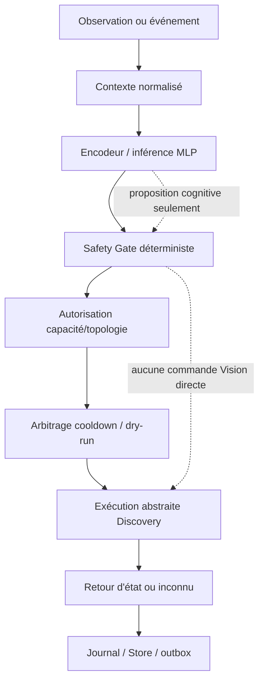

# Audit exhaustif d’avancement — Synora V1

Date de l’audit : 2026-10-06 UTC. Le présent rapport est fondé sur le dépôt
Git canonique et sur les commandes indiquées en annexe. Les documents de projet
sont utilisés comme contexte et comme contrats annoncés, jamais comme preuve
d’exécution.

## 1. Résumé exécutif

Synora est un prototype logiciel avancé du chemin Core/Bus/Discovery/Store,
avec une séparation de sécurité explicite et une Vision locale partiellement
intégrée. Le flux central hermétique et les tests de composants sont
substantiels, mais la V1 produit n’est pas prête : la suite centrale de base a
échoué sur 7 cas, le parcours caméra réel n’est pas démontré, la reconnaissance
faciale n’est pas qualifiée, les fonctions PTZ/audio/voix/recherche/règles ne
sont pas reliées en parcours produit, et le binaire installé n’est pas issu du
commit audité.

Le run média local Le2i est une preuve réelle de chargement RKNN, décodage de
48 clips, agrégation pose et traversée de gardes Core en `active_dry_run`.
Il ne prouve ni caméra/RTSP en production, ni métriques sémantiques de chute :
le rapport lui-même indique `semantic_qualification=not_qualified`, avec 25
cas marqués `observed_mismatch`.

Scores calculés :

- Avancement logiciel : **42/100**.
- Validation E2E : **42/100**.
- Qualification terrain : **19/100**.
- Score global V1 pondéré : **34/100**. Le plafond imposé par le terrain est
  respecté : 34 ne dépasse pas 19 de plus de 25 points.

**Verdict : prototype.** Une capacité critique de sûreté et plusieurs
parcours matériels restent entre 0 et 2 ; une déclaration « prête V1 » serait
contraire aux preuves disponibles.

## 2. Périmètre réellement audité

### Dépôt de référence

- Racine Git canonique : `/home/rock/Synora-v1`.
- Branche : `master`.
- HEAD : `0b34c0c43c359da4568afa5de0f619a5325ab350`.
- Commit : `feat: prepare central vision media harness`, daté du
  2026-10-06 01:27:55 UTC.
- Remote : `origin git@github.com:ANLEXISS/Synora.git`.
- État : dépôt sale. Modifiés : `Makefile`,
  `cmd/synora-central-test/main.go`, `cmd/synora-central-test/media.go`,
  `docs/vision-media-harness-v1.md`,
  `services/vision-worker/tests/test_central_yolov8_pose.py`,
  `tools/central_yolov8_pose.py`. Non suivis :
  `docs/vision-pose-le2i-harness-v1.md`,
  `services/vision-worker/core/yolov8_pose_backend.py` et
  `testdata/central-e2e-v1/media/`.
- Les modifications non committées ont évolué pendant l’audit. Les résultats
  sont donc séparés entre le run de base observé avant ces changements et le
  run média observé sur l’état courant. Aucun de ces changements n’a été
  effectué par cet audit.
- `/home/rock/Synora.partial-20260721T175212Z` et les autres copies sans
  `.git` n’ont pas été traitées comme référence produit.

### Services et matériel accessibles

- Code : services Go Bus, Core, Discovery, API, Runtime Manager, Connect et
  outils de test ; worker Python Vision et webapp statique.
- Système : RK3588/aarch64, noyau `6.1.43-26-rk2312`, `rknpu2.service` actif,
  `/usr/bin/rknn_server`, RKNNLite disponible, `/dev/video0` identifié comme
  entrée HDMI RX `rk_hdmirx`, pas comme caméra Synora.
- Services installés actifs : bus, runtime-manager, core, discovery, API,
  actions et MediaMTX. `synora-connect` est inactif.
- Limite importante : `/opt/synora/version.json` annonce le commit installé
  `c510e5a45aa691c571a75248bc0437bff44680e1`, différent du HEAD audité. L’état
  des services installés ne qualifie donc pas le code de `/home/rock/Synora-v1`.
- Artefacts externes utilisés uniquement pour le contrôle média :
  `/home/rock/Synora-test-media/le2i-v1`, contenant 48 clips et un modèle
  `yolov8n-pose-rk3588-toolkit22-fp.rknn`. Ils ne sont pas dans le dépôt et ne
  constituent pas une livraison versionnée.

## 3. Méthode et limites

L’échelle appliquée est celle demandée : 0 absent, 1 intention, 2 prototype,
3 intégré logiciellement, 4 E2E vérifié, 5 qualifié V1. Un modèle ou un nom de
fichier sans appel exécuté n’a reçu aucun crédit terrain. Les scores de domaine
utilisent la formule explicite `100 × (0,35 logiciel + 0,30 E2E + 0,35 terrain) / 5`.
Le score global est la moyenne pondérée des huit domaines selon les poids de la
demande.

### Commandes exécutées

Les commandes et résultats principaux sont :

| Commande | Résultat observé |
|---|---|
| `git rev-parse --show-toplevel`, `git branch --show-current`, `git rev-parse HEAD`, `git remote -v`, `git status --short` | dépôt/branche/HEAD/remote ci-dessus ; état sale détaillé ci-dessus |
| `go version` | `go1.24.0 linux/arm64` |
| `GOCACHE=/tmp/synora-audit-gocache go test ./...` | succès de tous les paquets Go ; aucun échec |
| `python3 -m compileall -q services/vision-worker` | succès |
| `python3 -m unittest discover -s services/vision-worker/tests -p 'test_*.py'` | **89 tests, OK**, 0 échec |
| `GOCACHE=... go run ./cmd/synora-central-test --manifest testdata/central-e2e-v1/manifest.json --out /tmp/synora-audit-central.json` | **401 cas, 394 passés, 7 échoués** |
| `GOCACHE=... go run ./cmd/synora-central-test --case pose-movement-001 --out /tmp/synora-audit-case.json` | 1/1 ; signaux pose synthétiques, backends Vision réels indisponibles dans ce mode |
| `PYTHONPATH=services/vision-worker python3 tools/central_yolov8_pose.py --diagnostic --model /home/rock/Synora-test-media/le2i-v1/models/yolov8n-pose-rk3588-toolkit22-fp.rknn` | succès : modèle chargé, quatre formes RKNN vérifiées sur RK3588 |
| run média Le2i avec `--media`, manifest versionné, `SYNORA_VISION_MEDIA_ROOT` et `SYNORA_POSE_RKNN_MODEL` externes | **48/48**, hashes et métadonnées validés, pose RKNN disponible, sûreté pass ; qualification sémantique explicitement `not_qualified` |
| `python3 tools/verify_rtmpose_clip.py --clip /home/rock/test3.mp4 --out /tmp/synora-audit-rtmpose.json` | code 0 mais sortie `pose_status=unavailable`, `fall_validation=not_performed`, modèle vide |
| contrôles `systemctl`, `uname`, `rknn_server`, `v4l2-ctl`, `ip`, `iw`, `ss` | matériel et services présents ; aucune caméra Synora/RTSP de caméra prouvée |
| import Python `cv2,numpy,scipy,rknnlite,onnx,onnxruntime,torch,mmpose,mmdeploy` | cv2/numpy/scipy/rknnlite présents ; ONNX/ONNX Runtime/PyTorch/MMPose/MMDeploy absents |
| `curl` vers API installée | API installée répond ; ce binaire n’est pas celui du HEAD audité |

La cible `make test` n’a pas été lancée telle quelle : son premier sous-parcours
est le harnais central et le run équivalent a déjà montré 7 échecs ; les
tests Go et Python qu’elle enchaîne ont été lancés séparément. Aucun service,
configuration, donnée ou test n’a été modifié par l’audit.

## 4. Cartographie de l’architecture réelle

### Composants observés

- **Bus Unix** : `internal/bus/server.go`, `client.go`, `acl.go`, `auth.go`.
  ACL par service, authentification optionnelle par message, anti-rejeu et
  identité de processus.
- **Core** : `cmd/synora-core/main.go` instancie
  `internal/cognitivecore.Core`, `SafetyGate{DryRun:true}` et
  `UniversalStore`. Sans bundle configuré, il démarre fail-closed avec
  `UnavailableMLP`.
- **Cognitive Core** : snapshot normalisé 86D, encodeur versionné, bundle CPU
  MLP V1 ou candidat V3, Safety Gate et action outbox.
- **Discovery** : frontière externe ; ingress caméra, registre caméra,
  supervision offline, cache média, worker Vision, topologie réseau,
  MediaMTX, API externe et synchronisation du dataset visage.
- **Vision Worker** : pipeline Python clip/segment, détecteur YOLO RKNN,
  tracking local, enrichissements optionnels et FaceRecognizer/ArcFace.
  Le backend pose Le2i courant est une modification non committée et reste
  explicitement aggregate-only.
- **Stockage** : `internal/cognitivecore.UniversalStore` pour le chemin Core
  actif ; `internal/state.Store` constitue un second store riche, mais le
  binaire `cmd/synora-core` n’en instancie pas.
- **API/Web** : le binaire `synora-api` expose la topologie et les traces MLP,
  plus WebSocket ; la webapp ne contient que la page Intelligence.
- **Déploiement** : unités systemd pour Bus/Core/Discovery/Runtime Manager/
  Connect/MediaMTX dans le dépôt ; les unités installées incluent aussi un
  `synora-actions.service` absent du dépôt audité.

### Flux réellement démontré

Le flux `SIM → BUS → Discovery → Core → MLP → Store` est démontré par le
harnais central. Le flux `CAM → Discovery` est couvert par des tests et des
handlers, mais pas par une caméra réseau réelle pendant cet audit. Le flux
Vision média Le2i ouvre RKNN et lit des clips locaux, pas un flux caméra.

### Chaîne de décision

Dans le code actuel, `EX` est toujours simulée ou bloquée :
`internal/discovery/boundary_v1.go:152-177` force
`physical_action_executed=false`, et `cmd/synora-core/main.go:53` force le
dry-run.

## 5. Scores par domaine

| Domaine | Score logiciel | Score E2E | Score terrain | Score V1 pondéré | Verdict |
|---|---:|---:|---:|---:|---|
| Centrale | 3,5/5 | 3,5/5 | 2,0/5 | 60/100 | intégré et testable, non qualifié terrain |
| Caméras et PTZ | 2,0/5 | 2,5/5 | 1,5/5 | 40/100 | clip/RKNN partiel, caméra/PTZ non prouvés |
| Compréhension du domicile | 2,5/5 | 2,5/5 | 1,0/5 | 40/100 | topologie et agrégats, pas de compréhension habitée E2E |
| Assistant vocal et interactions | 1,0/5 | 1,0/5 | 0,0/5 | 14/100 | contrats/capacités déclarés, parcours absent |
| Recherche et suivi | 1,0/5 | 0,5/5 | 0,0/5 | 11/100 | pas de service de recherche/PTZ |
| Actions et automatisations | 2,0/5 | 2,0/5 | 0,5/5 | 30/100 | proposition et dry-run, pas d’exécution terrain |
| Adaptation au domicile | 1,0/5 | 0,5/5 | 0,0/5 | 11/100 | données baseline et validations, apprentissage produit absent |
| Application et contrôle utilisateur | 1,5/5 | 1,0/5 | 0,5/5 | 18/100 | seule surface Intelligence réellement livrée |

Les scores globaux issus des mêmes pondérations sont logiciel 42/100, E2E
42/100 et terrain 19/100. Le principal est calculé à 34/100.

## 6. Matrice de couverture fonctionnelle détaillée

Les statuts ci-dessous emploient `absent`, `intention`, `prototype`, `intégré`,
`E2E vérifié` ou `qualifié`. Chaque entrée sépare preuve, parcours et limites.

### 6.1 Centrale

#### 1.1 Découverte, appairage et supervision des caméras

- **Statut :** intégré.
- **Score :** 3/5.
- **Preuves :** `internal/discovery/runtime/device.go:65-164` registre caméra,
  identité matérielle et événements online/offline ; `internal/discovery/manager.go:89-113`
  vérification device ; `internal/discovery/runtime/loop.go:14-117` timeout 30 s.
- **Parcours réel :** observation caméra → registre Discovery → message
  `discovery.camera.*`/`device.offline` vers Core ; état mémoire du registre.
- **Limites :** découverte réseau et caméra réelle non exécutées ; appairage
  complet dépend de la configuration installée et de secrets non fournis.
- **Risques :** état de supervision non durable dans ce registre ; caméra
  inconnue ou usurpée ; trou de couverture non transformé en preuve métier.
- **Écart vers V1 :** test avec caméra compatible, reboot, perte réseau,
  re-pairing et preuve d’état durable ; sortie : caméra authentifiée et
  offline/online observable dans Store.
- **Priorité :** P1 essentiel.

#### 1.2 Découverte, appairage et supervision des équipements compatibles

- **Statut :** prototype.
- **Score :** 2/5.
- **Preuves :** `internal/device/devices.go`, `configs/devices.yaml` et
  `internal/discovery/network/pairing.go` décrivent registre/configuration et
  fenêtre de pairing ; aucune matrice d’équipements/driver n’est appelée par
  le Core actif.
- **Parcours réel :** YAML/registre → validation réseau → événements Discovery.
- **Limites :** équipements lumière, garage, serrure, audio et PTZ sans
  adaptateur produit prouvé ; `synora-actions` installé est hors dépôt/commit.
- **Risques :** capacité déclarée mais non disponible ; résolution d’un
  équipement différent de la cible ; commandes sans retour matériel.
- **Écart vers V1 :** choisir un protocole et un appareil supporté, implémenter
  discovery/health/command/result et tester débranchement/reconnexion.
- **Priorité :** P0 bloquant pour toute action physique.

#### 1.3 Traitement local des données visuelles

- **Statut :** intégré partiellement.
- **Score :** 3/5.
- **Preuves :** `internal/discovery/vision/runtime.go`, `segment_worker.go` et
  `services/vision-worker/core/clip_pipeline_v1.py` ; le run Le2i a appelé
  RKNN réel et produit des agrégats ; le rapport `/tmp/synora-audit-media.json`
  indique `pose_backend_status=available`.
- **Parcours réel :** clip local → OpenCV/RKNN → pose/posture/fall candidate →
  fixture Core V3 ; aucun pixel/keypoint ne sort du processus.
- **Limites :** pas de caméra live, pas de RTSP→Vision prouvé ; sémantique non
  qualifiée, 25 mismatches Le2i.
- **Risques :** faux négatifs/positifs, identités ou coordonnées introduites
  par une future extension, latence non représentative du flux réel.
- **Écart vers V1 :** caméra/RTSP représentative, modèle versionné, métriques
  holdout annotées, budgets et reprise ; sortie : critères sémantiques validés.
- **Priorité :** P1 essentiel.

#### 1.4 Traitement local des données audio

- **Statut :** intention.
- **Score :** 1/5.
- **Preuves :** `configs/devices.yaml` déclare microphone/speaker/TTS/wakeword
  pour `relay_01/relay_02`, mais aucun pipeline ASR/TTS/audio n’est appelé dans
  `cmd/synora-core`, Discovery ou le worker.
- **Parcours réel :** aucun parcours production ; seulement capacité YAML.
- **Limites :** format audio, consentement, VAD, modèle, routage et mesures
  absents ; les harnesses imposent `audio_rendered=false`.
- **Risques :** écoute non consentie, fuite de voix, mauvaise zone ou mauvais
  interlocuteur.
- **Écart vers V1 :** sélectionner ASR/TTS local, consentement, routage zoné,
  tests de bruit/latence et preuve de non-rendu par défaut.
- **Priorité :** P1 essentiel.

#### 1.5 Représentation du domicile

- **Statut :** intégré partiellement.
- **Score :** 3/5.
- **Preuves :** `configs/topology.yaml` contient zones, étages, pièces et
  liens ; `internal/topology/loader.go:FromConfig` valide le graphe ;
  `internal/cognitivecore/snapshot.go:69-85` ne transporte toutefois qu’une
  classe `Topology` et des faits agrégés.
- **Parcours réel :** YAML → graphe Topology ; événements Vision → classe de
  topologie dans CognitiveSnapshot.
- **Limites :** équipement/personne/animal/objet enregistré non reliés au
  snapshot Core actif ; pas d’éditeur/API produit prouvé.
- **Risques :** topologie déclarée différente de la topologie d’installation ;
  ambiguïté d’entité.
- **Écart vers V1 :** source unique versionnée pour topologie et entités,
  mutation autorisée, migration et test de cohérence avec caméras.
- **Priorité :** P1 essentiel.

#### 1.6 Centralisation observations, états, événements, règles, rappels, préférences

- **Statut :** intégré pour observations/états Core ; absent pour règles,
  rappels et préférences produit.
- **Score :** 3/5.
- **Preuves :** `internal/cognitivecore/store.go:93-230` journal/WAL, état,
  décisions et outbox ; `internal/cognitivecore/snapshot.go` encode les faits.
  `internal/state/store.go:20-54` montre un store plus riche non instancié par
  `cmd/synora-core/main.go:35-54`.
- **Parcours réel :** événement → snapshot → décision → commit atomique →
  journal/outbox.
- **Limites :** deux modèles de Store ; règles/rappels/préférences non actifs.
- **Risques :** divergence des sources de vérité, perte de contexte métier,
  historique non visible dans l’UI actuelle.
- **Écart vers V1 :** choisir le store autoritaire, brancher entités/règles/
  rappels et vérifier migration/restart/rejeu.
- **Priorité :** P0 bloquant.

#### 1.7 Orchestration selon événements et demandes utilisateur

- **Statut :** intégré en dry-run.
- **Score :** 3/5.
- **Preuves :** `internal/cognitivecore/service.go:31-109` consomme le Bus,
  appelle Core, publie décision/snapshot/action ; `internal/cognitivecore/core.go:55-131`
  compose, encode, infère, gate et commit.
- **Parcours réel :** message Bus → Core → MLP → Safety Gate → Store → action
  abstraite vers Discovery.
- **Limites :** demandes vocales et règles absentes ; 7 cas du run de base
  ont échoué ; production Core démarre sans bundle promu.
- **Risques :** régression de contrat, action répétée, contexte incomplet.
- **Écart vers V1 :** réparer les 7 cas, ajouter tests de séquence et demandes
  utilisateur autorisées, puis E2E multi-process sur installation courante.
- **Priorité :** P0 bloquant.

#### 1.8 Pertes de connexion, pannes et indisponibilités

- **Statut :** intégré partiellement.
- **Score :** 3/5.
- **Preuves :** `internal/discovery/runtime/loop.go:61-117` publie offline ;
  `internal/discovery/health.go`, `vision/worker_manager.go` et `recovery`
  exposent des statuts ; `internal/discovery/manager.go:237-251` dégrade le
  worker.
- **Parcours réel :** timeout/échec worker → événement ou health → Core/ops.
- **Limites :** pas de validation d’une panne caméra/RTSP réelle ni d’une
  alerte utilisateur durable ; le connect distant reste inactif.
- **Risques :** faux état online, silence lors d’un trou de couverture,
  reprise non ordonnée.
- **Écart vers V1 :** fault injection réseau/caméra/worker, reboot et critère
  d’alerte visible + audit Store.
- **Priorité :** P1 essentiel.

### 6.2 Caméras intérieures et PTZ extérieures

#### 2.1 Capture vidéo et audio

- **Statut :** prototype.
- **Score :** 2/5.
- **Preuves :** `internal/discovery/ingress/server.go:124-346` accepte des clips
  multipart signés ; `internal/mediamtx` et unité MediaMTX existent ; le run
  réel a lu des fichiers, pas une caméra.
- **Parcours réel :** upload caméra → cache/clip local → queue Vision.
- **Limites :** aucun RTSP/ONVIF caméra prouvé ; audio non traité.
- **Risques :** source non authentifiée, média incomplet, rétention excessive.
- **Écart vers V1 :** caméra supportée, RTSP/ONVIF réel, capture audio opt-in,
  métadonnées et reprise testées.
- **Priorité :** P0 bloquant.

#### 2.2 Détection humains, véhicules, animaux, objets

- **Statut :** prototype.
- **Score :** 2/5.
- **Preuves :** `services/vision-worker/modules/detect/person_detector.py` est
  un détecteur humain YOLO RKNN ; `edge/manifest.py` catalogue human/vehicle/
  animal/unknown ; aucun appel qualifié vehicle/animal/objet sensible n’a été
  observé.
- **Parcours réel :** frame/clip → backend humain quand modèle disponible →
  détection locale ou résumé.
- **Limites :** modèles `det_10g.rknn` et autres absents de `/var/lib/synora`;
  le worker déclare `weapon_detection` non activé et `fall_detection`
  indisponible.
- **Risques :** catégorie inventée par contrat, faux positifs/négatifs,
  modèle absent traité comme capacité.
- **Écart vers V1 :** matrice de catégories réellement supportées, modèles
  présents, métriques par classe et tests adversariaux.
- **Priorité :** P1 essentiel.

#### 2.3 Reconnaissance des personnes enregistrées

- **Statut :** prototype local.
- **Score :** 2/5.
- **Preuves :** `services/vision-worker/modules/face/FaceRecognizer.py` et
  `core/pipeline.py` ont embedding/matching ; `worker.py:145-160` initialise
  FaceRecognizer seulement si activé et si modèle disponible ; aucun modèle
  ArcFace dans `/var/lib/synora/models`.
- **Parcours réel :** face crop en mémoire → ArcFace si disponible → match
  dataset local → statut.
- **Limites :** pas d’exécution modèle dans le run central ; tests utilisent
  fakes ; photos de configuration sont vides.
- **Risques :** biométrie, mauvaise identité, fuite d’embedding, absence
  d’incertitude calibrée.
- **Écart vers V1 :** modèle/licence, dataset réel consenti, qualification
  inconnue/incertaine/reconnue et tests d’usurpation.
- **Priorité :** P0 bloquant si la promesse d’identité est conservée.

#### 2.4 Distinction inconnue, incertaine, reconnue

- **Statut :** intégré dans le pipeline local, non intégré produit.
- **Score :** 2/5.
- **Preuves :** `core/pipeline.py` compte `known_faces`, `uncertain_faces`,
  `unknown_faces`; tests Python vérifient les trois chemins.
- **Parcours réel :** résultat face → buffer par track → statut local.
- **Limites :** statut absent des parcours Core V1 actifs ; pas de seuils
  qualifiés ni de politique utilisateur.
- **Risques :** confusion identité/autorisation, escalade d’une incertitude.
- **Écart vers V1 :** contrat bus sans biométrie brute, seuils calibrés,
  expiration et revue humaine.
- **Priorité :** P1 essentiel.

#### 2.5 Détection de chutes suspectées

- **Statut :** prototype expérimental.
- **Score :** 2/5.
- **Preuves :** le backend Le2i produit seulement `fall_state=none|candidate`
  dans `services/vision-worker/core/yolov8_pose_backend.py`; le run 48 clips
  enregistre 3 candidats au total et interdit `confirmed`.
- **Parcours réel :** 16 frames clip → pose → transition temporelle → signal
  candidate → V3/Core dry-run.
- **Limites :** `fall_detection` est déclaré unavailable dans `worker.py`; le
  clip documenté `test3.mp4` retourne `fall_validation=not_performed`.
- **Risques :** faux négatif de sécurité, fausse alerte, absence de dialogue
  de vérification et de temporisation utilisateur.
- **Écart vers V1 :** protocole de chute défini, dataset annoté holdout,
  métriques, interaction de vérification et test caméra réel.
- **Priorité :** P0 bloquant.

#### 2.6 Objets dangereux définis

- **Statut :** intention.
- **Score :** 1/5.
- **Preuves :** `worker.py:219-228` expose un modèle `weapon` optionnel mais
  indique que le détecteur n’est pas activé dans le pipeline.
- **Parcours réel :** aucun.
- **Limites :** catégories, modèle, seuils et action associée non prouvés.
- **Risques :** alarme injustifiée ou omission d’un objet critique.
- **Écart vers V1 :** retirer la promesse ou qualifier un détecteur avec
  politique conservatrice et revue humaine.
- **Priorité :** P2 important.

#### 2.7 Obstruction ou sabotage de caméra

- **Statut :** prototype.
- **Score :** 2/5.
- **Preuves :** événement `vision.tamper` dans `pkg/contract/event.go` et
  familles camera health dans les fixtures ; aucune analyse de pixels ou
  événement issu d’une caméra réelle observé.
- **Parcours réel :** fixture/état caméra → événement de santé → Core dans le
  harness.
- **Limites :** pas de seuil, fenêtre, anti-faux-positif ni test sabotage réel.
- **Risques :** caméra déclarée sûre alors qu’elle est obstruée ; alertes
  répétitives.
- **Écart vers V1 :** séquences no-signal/lentille déplacée/obscurité,
  heartbeat et procédure d’escalade.
- **Priorité :** P1 essentiel.

#### 2.8 Suivi de cible dans le champ

- **Statut :** prototype local.
- **Score :** 2/5.
- **Preuves :** `services/vision-worker/edge/tracker.py` et
  `modules/tracking/tracker.py` gèrent un tracking local borné ; identifiants
  explicitement process-local dans `docs/edge-vision-compute-split-v1.md`.
- **Parcours réel :** frames d’un clip → track local → résumé agrégé.
- **Limites :** pas de flux live ni de contrat de suivi utilisateur ; pas
  d’association inter-caméras prouvée.
- **Risques :** ID réutilisé, perte de cible, suivi d’une mauvaise personne.
- **Écart vers V1 :** cible explicitement consentie, TTL, annulation,
  métriques de continuité et caméra réelle.
- **Priorité :** P2 important.

#### 2.9 Orientation PTZ

- **Statut :** absent.
- **Score :** 0/5.
- **Preuves :** aucune implémentation PTZ/ONVIF/commande d’orientation trouvée
  dans le code produit ; `rg` sur `PTZ|ONVIF|ptz` ne retourne que des limites ou
  textes sans appel de driver.
- **Parcours réel :** aucun.
- **Limites :** caméra PTZ, capacités, limites mécaniques et retour de position
  non présents.
- **Risques :** mouvement dangereux, caméra hors zone, absence d’arrêt.
- **Écart vers V1 :** décider support/abandon ; si support, ONVIF réel,
  limites, stop, permissions, position connue et tests adversariaux.
- **Priorité :** P0 bloquant pour la promesse PTZ.

#### 2.10 Suivi PTZ

- **Statut :** absent.
- **Score :** 0/5.
- **Preuves :** aucun contrat ou appel PTZ ; aucun événement de commande dans
  `pkg/contract` dédié au PTZ.
- **Parcours réel :** aucun.
- **Limites :** orientation, suivi, perte de cible et timeout inexistants.
- **Risques :** mouvement continu ou poursuite d’une mauvaise cible.
- **Écart vers V1 :** contrat idempotent et stop garanti avant tout pilote.
- **Priorité :** P0 bloquant.

#### 2.11 Recherche PTZ dans les zones accessibles

- **Statut :** absent.
- **Score :** 0/5.
- **Preuves :** aucun planificateur de balayage, zone accessible ou preuve de
  retour caméra dans le dépôt.
- **Parcours réel :** aucun.
- **Limites :** topologie seule ne définit pas l’espace mécanique PTZ.
- **Risques :** violation de zones privées, collision, indisponibilité caméra.
- **Écart vers V1 :** modèle de zones/permissions, plan borné, arrêt et audit.
- **Priorité :** P0 bloquant.

### 6.3 Compréhension du domicile

#### 3.1 Association inter-caméras d’une même entité

- **Statut :** prototype.
- **Score :** 2/5.
- **Preuves :** `internal/state/tracking.go:42-118` contient `EntityTrackID`
  borné par activation/caméra ; ce store n’est pas branché au `Core` actif.
- **Parcours réel :** disponible seulement via API de package/test ; aucun
  message multi-caméras traversant Discovery→Core observé.
- **Limites :** pas de ré-identification qualifiée, pas d’identité persistante
  sûre, pas de politique de confiance.
- **Risques :** fusion de personnes, suivi trans-zone non autorisé.
- **Écart vers V1 :** connecter le store autoritaire, tests d’ambiguïté et
  coupures de caméra, expiration stricte.
- **Priorité :** P1 essentiel.

#### 3.2 Reconstitution de déplacements par topologie

- **Statut :** prototype.
- **Score :** 2/5.
- **Preuves :** graphe topologique validé par `internal/topology/loader.go` et
  liens de `configs/topology.yaml`; aucune fonction de chemin temporel dans le
  Core actif n’a été appelée.
- **Parcours réel :** graphe statique → classe de zone éventuelle ; pas de
  séquence réelle de passages.
- **Limites :** trous de couverture, portes et temporalité non intégrés.
- **Risques :** trajet déduit à tort, présence dans une pièce inventée.
- **Écart vers V1 :** algorithme déterministe, horodatage, couverture et tests
  de graphes contradictoires.
- **Priorité :** P1 essentiel.

#### 3.3 Arrivées, départs, passages, occupation

- **Statut :** intention/prototype.
- **Score :** 1/5.
- **Preuves :** `internal/state` contient `Presence`, `ResidentTrack` et
  `EventWindow`; le Core actif ne les remplit pas depuis les événements Vision
  du harness.
- **Parcours réel :** aucun parcours produit complet.
- **Limites :** résident, invité, animal et zone occupée non validés sur cible.
- **Risques :** automatisation déclenchée sur une présence fausse.
- **Écart vers V1 :** définir états et transitions, puis E2E multi-caméras avec
  expiration et incertitude.
- **Priorité :** P1 essentiel.

#### 3.4 Regroupement d’observations en événements cohérents

- **Statut :** intégré partiellement.
- **Score :** 3/5.
- **Preuves :** `internal/discovery/vision/clip_manager.go` gère épisode,
  continuité et fenêtres ; `segment_runtime.go` gère réordonnancement/TTL ;
  tests unitaires et E2E synthétique présents.
- **Parcours réel :** segments → épisode clip → résumé versionné → Core.
- **Limites :** caméra réelle, charge et pertes prolongées non testées ; store
  état riche non raccordé.
- **Risques :** doublons, épisodes coupés, gaps invisibles.
- **Écart vers V1 :** test 24 h multi-caméras, redémarrages, retards et
  rejouabilité.
- **Priorité :** P1 essentiel.

#### 3.5 Séparation faits, déductions, informations utilisateur

- **Statut :** intégré pour la frontière Vision/Core ; absent côté produit
  utilisateur.
- **Score :** 3/5.
- **Preuves :** `internal/cognitivecore/vision_evidence.go` distingue origine
  Vision/Core et faits agrégés ; `boundary_v1.go:87-109` refuse media,
  embedding et identité brute.
- **Parcours réel :** payload validé → evidence frame → snapshot ; les règles
  utilisateur ne sont pas dans ce chemin.
- **Limites :** pas de vue expliquant fait/déduction/validation utilisateur.
- **Risques :** habitude ou inférence présentée comme vérité.
- **Écart vers V1 :** contrats de provenance visibles, revue/correction et
  tests de fuite de données.
- **Priorité :** P1 essentiel.

#### 3.6 Dernières positions avec horodatage et confiance

- **Statut :** prototype.
- **Score :** 2/5.
- **Preuves :** `internal/state/tracking.go` conserve `LastSeen` et confiance,
  bornée par `boundConfidence`; pas de chemin actif Core/UI pour l’exposer.
- **Parcours réel :** API de store/test uniquement.
- **Limites :** expiration, couverture et conflit de positions non démontrés.
- **Risques :** position périmée utilisée comme actuelle.
- **Écart vers V1 :** TTL, statut `unknown`, provenance par caméra et affichage
  explicable.
- **Priorité :** P1 essentiel.

#### 3.7 Habitudes sans élévation en permissions

- **Statut :** intention.
- **Score :** 1/5.
- **Preuves :** `configs/residents.yaml` contient des baselines horaires/pièces
  et `internal/state` expose `BehaviorOverrides`; aucune mise à jour
  progressive ni permission issue d’habitude n’est appelée.
- **Parcours réel :** YAML initial seulement.
- **Limites :** pas d’apprentissage consultatif, hypothèse ou confirmation.
- **Risques :** décision implicite et absence de consentement.
- **Écart vers V1 :** séparer explicitement observation, hypothèse, préférence
  confirmée et permission ; tests de non-escalade.
- **Priorité :** P0 bloquant.

### 6.4 Assistant vocal et interactions

#### 4.1 Compréhension selon interlocuteur, zone, contexte

- **Statut :** absent.
- **Score :** 0/5.
- **Preuves :** aucun ASR/NLU/contexte conversationnel dans `cmd`,
  `internal` ou `services`; capacités vocales ne sont que dans
  `configs/devices.yaml`.
- **Parcours réel :** aucun.
- **Limites :** identité vocale, zone, mémoire de dialogue et consentement
  inexistants.
- **Risques :** commande d’un tiers, mauvaise zone, écoute permanente.
- **Écart vers V1 :** définir une voie vocale locale complète et un contrat de
  permission avant toute promesse.
- **Priorité :** P1 essentiel.

#### 4.2 Questions sur événements/personnes/animaux/équipements

- **Statut :** absent.
- **Score :** 0/5.
- **Preuves :** API actuelle expose seulement Intelligence topologie/traces
  (`cmd/synora-api/main.go:45-56`), aucune route question/réponse.
- **Parcours réel :** aucun.
- **Limites :** pas d’index, recherche, synthèse ni justification utilisateur.
- **Risques :** réponses inventées ou divulgation d’historique.
- **Écart vers V1 :** requêtes en lecture bornées sur Store, réponses sourcées,
  refus si donnée absente.
- **Priorité :** P2 important.

#### 4.3 Clarification

- **Statut :** absent.
- **Score :** 0/5.
- **Preuves :** aucun état de dialogue/intent de clarification dans les
  contrats ou services audités.
- **Parcours réel :** aucun.
- **Limites :** conflit personne/zone/commande non traité.
- **Risques :** exécution sur interprétation ambiguë.
- **Écart vers V1 :** machine d’état conversationnelle et tests adversariaux.
- **Priorité :** P1 essentiel.

#### 4.4 Interaction après chute suspectée

- **Statut :** absent.
- **Score :** 0/5.
- **Preuves :** le Vision backend interdit `confirmed` et le Core ne publie
  qu’une action abstraite ; aucun dialogue, minuterie ou acquittement vocal.
- **Parcours réel :** candidate → dry-run éventuel, sans interaction.
- **Limites :** pas d’appel secours, consentement ou escalade.
- **Risques :** absence d’aide ou fausse escalade.
- **Écart vers V1 :** spécification de réponse humaine et tests sans audio réel
  puis audio local qualifié.
- **Priorité :** P0 bloquant.

#### 4.5 Messages entre utilisateurs et zones

- **Statut :** intention.
- **Score :** 1/5.
- **Preuves :** `configs/devices.yaml` déclare des relais speaker/TTS ;
  `internal/discovery/web_v1.go` accepte un POST message mais ne fait que
  publier un événement, sans rendu audio.
- **Parcours réel :** POST auth bearer éventuel → événement Discovery/Core ;
  aucune sortie relais.
- **Limites :** routage zone, audio et accusé de réception absents.
- **Risques :** message au mauvais endroit ou non délivré.
- **Écart vers V1 :** renderer local, zones et résultat `delivered/unknown`.
- **Priorité :** P2 important.

#### 4.6 Accueil des invités selon identité/consignes

- **Statut :** absent.
- **Score :** 0/5.
- **Preuves :** résidents YAML et face metadata existent, mais aucun flux
  invité/consigne/accueil dans le Core ou l’API.
- **Parcours réel :** aucun.
- **Limites :** identité non qualifiée, consignes absentes.
- **Risques :** divulgation ou ouverture à un inconnu.
- **Écart vers V1 :** retirer la promesse ou définir un workflow explicite et
  sans commande de sécurité automatique.
- **Priorité :** P1 essentiel.

#### 4.7 Mémorisation d’expressions et corrections confirmées

- **Statut :** absent.
- **Score :** 0/5.
- **Preuves :** aucune mémoire d’expression vocale ni endpoint de correction ;
  `ValidationRequest` est un contrat général, pas un parcours vocal.
- **Parcours réel :** aucun.
- **Limites :** pas de consentement, version ni suppression ciblée.
- **Risques :** apprentissage non voulu, préférence transformée en permission.
- **Écart vers V1 :** mémoire locale explicitement confirmée, réversible et
  auditée.
- **Priorité :** P2 important.

### 6.5 Recherche et suivi à la demande

#### 5.1 Recherche d’une personne, animal ou objet enregistré

- **Statut :** absent.
- **Score :** 0/5.
- **Preuves :** aucune route/service de recherche ; l’API actuelle ne sert que
  topologie/traces Intelligence.
- **Parcours réel :** aucun.
- **Limites :** catégories prises en charge et zones couvertes non exposées.
- **Risques :** recherche biométrique non autorisée ou réponse inventée.
- **Écart vers V1 :** endpoint lecture borné, permissions et absence de résultat
  explicite.
- **Priorité :** P2 important.

#### 5.2 Consultation des dernières observations

- **Statut :** prototype.
- **Score :** 1/5.
- **Preuves :** `internal/state.Store` possède événements/tracks ; `Discovery`
  a un historique en test, mais l’API active `synora-api` n’expose pas ces
  données.
- **Parcours réel :** package Store → tests ; pas d’UI produit.
- **Limites :** rétention, confiance et provenance non visibles.
- **Risques :** historique sensible exposé au mauvais rôle.
- **Écart vers V1 :** projection autorisée et recherche avec TTL/confiance.
- **Priorité :** P1 essentiel.

#### 5.3 Recherche complémentaire déclenchée si nécessaire

- **Statut :** absent.
- **Score :** 0/5.
- **Preuves :** aucun planner de recherche ou demande de caméra secondaire.
- **Parcours réel :** aucun.
- **Limites :** budget, durée, annulation et zones non définis.
- **Risques :** collecte disproportionnée et boucle de recherche.
- **Écart vers V1 :** orchestration bornée, consentement et audit.
- **Priorité :** P2 important.

#### 5.4 Sélection de caméra pertinente

- **Statut :** prototype.
- **Score :** 1/5.
- **Preuves :** topologie/caméra existent ; aucun sélecteur de caméra relié à
  une requête utilisateur.
- **Parcours réel :** caméra/zone dans métadonnées clip seulement.
- **Limites :** couverture, indisponibilité et pertinence non calculées.
- **Risques :** caméra erronée ou zone privée.
- **Écart vers V1 :** index couverture-topologie et test de sélection sous panne.
- **Priorité :** P1 essentiel.

#### 5.5 Orientation des PTZ disponibles

- **Statut :** absent.
- **Score :** 0/5.
- **Preuves :** aucun driver PTZ/ONVIF.
- **Parcours réel :** aucun.
- **Limites :** aucune capacité PTZ ni retour de position.
- **Risques :** idem 2.9.
- **Écart vers V1 :** même exigence ONVIF, limites, stop et permissions.
- **Priorité :** P0 bloquant.

#### 5.6 Suivi inter-caméras

- **Statut :** absent.
- **Score :** 0/5.
- **Preuves :** tracker local seulement ; le document Edge précise aucun
  tracking central normal pour le chemin `edge-v1`.
- **Parcours réel :** aucun parcours inter-caméras observé.
- **Limites :** association, gaps, identités et topologie non reliés.
- **Risques :** fausse continuité d’identité.
- **Écart vers V1 :** protocole d’association ambiguë et holdout multi-caméras.
- **Priorité :** P1 essentiel.

#### 5.7 Signalement des pertes de couverture/associations incertaines

- **Statut :** prototype.
- **Score :** 2/5.
- **Preuves :** événements `device.offline`, `gap_count` et états uncertain
  dans les contrats/fixtures ; pas de vue ou alerte de recherche.
- **Parcours réel :** gap → résumé/health → Core possible.
- **Limites :** pas de test de recherche utilisateur ni de résolution de
  conflit.
- **Risques :** absence prise pour absence de personne.
- **Écart vers V1 :** état `unknown` obligatoire, alertes et explication.
- **Priorité :** P1 essentiel.

#### 5.8 Surveillance temporaire cible/objet/zone

- **Statut :** absent.
- **Score :** 0/5.
- **Preuves :** aucun contrat de watch temporaire, TTL ou annulation.
- **Parcours réel :** aucun.
- **Limites :** cible, durée, autorisation et coût inexistants.
- **Risques :** surveillance persistante non consentie.
- **Écart vers V1 :** workflow opt-in, durée bornée, révocation et audit.
- **Priorité :** P2 important.

### 6.6 Actions et automatisations

#### 6.1 Notifications, messages audio, enregistrements, commandes équipements

- **Statut :** intégré pour proposition/dry-run, absent pour exécution réelle.
- **Score :** 2/5.
- **Preuves :** `pkg/contract/action.go`, `internal/cognitivecore/decision.go:609-654`
  et `internal/discovery/boundary_v1.go:152-177`; les rapports imposent
  `audio_rendered=false` et `physical_action_executed=false`.
- **Parcours réel :** MLP → Gate → action outbox → Discovery dry-run → résultat.
- **Limites :** pas d’action physique ni de retour matériel ; actions installé
  hors dépôt.
- **Risques :** annoncer un succès simulé comme réel.
- **Écart vers V1 :** adaptateur unique par protocole, résultat vérifié et
  distinction `unknown`.
- **Priorité :** P0 bloquant.

#### 6.2 Accompagnement lumineux

- **Statut :** intention/prototype.
- **Score :** 1/5.
- **Preuves :** action abstraite `light` dans `AbstractActions` et labels V3 ;
  aucun driver lumière ou état d’équipement.
- **Parcours réel :** proposition MLP éventuelle, dry-run.
- **Limites :** zone libérée/occupants et commande réelle absents.
- **Risques :** extinction ou allumage erroné.
- **Écart vers V1 :** équipement supporté, verrouillage et retour confirmé.
- **Priorité :** P1 essentiel.

#### 6.3 Extinction zone libérée avec autres occupants

- **Statut :** absent.
- **Score :** 0/5.
- **Preuves :** aucune règle d’occupation/action couplée démontrée ; présence
  n’est pas alimentée dans le Core actif.
- **Parcours réel :** aucun.
- **Limites :** conflit occupants/capteurs non traité.
- **Risques :** extinction dangereuse ou inconfortive.
- **Écart vers V1 :** règle déterministe avec preuve d’occupation et résultat.
- **Priorité :** P1 essentiel.

#### 6.4 Porte de garage avec conditions, permissions et sécurités

- **Statut :** absent.
- **Score :** 0/5.
- **Preuves :** `garage`, contrôleur de porte et interlock absents du dépôt ;
  aucune action Garage dans le catalogue abstrait.
- **Parcours réel :** aucun.
- **Limites :** pas de capteur fermé/ouvert, présence, obstacle, permission ou
  arrêt d’urgence.
- **Risques :** ouverture non autorisée, blessure, intrusion.
- **Écart vers V1 :** ne pas promettre ; à terme protocole certifié, interlocks,
  double confirmation, retour fermé et tests adversariaux.
- **Priorité :** P0 bloquant.

#### 6.5 Création d’automatisation depuis la voix avec confirmation

- **Statut :** absent.
- **Score :** 0/5.
- **Preuves :** aucune entité automation active dans Core/API/worker ; le Bus
  autorise des préfixes `automations.` mais cela n’est pas une implémentation.
- **Parcours réel :** aucun.
- **Limites :** interprétation, prévisualisation et confirmation absentes.
- **Risques :** règle persistante créée sur malentendu.
- **Écart vers V1 :** DSL versionné, preview, confirmation forte, rollback et
  tests de conflits.
- **Priorité :** P1 essentiel.

#### 6.6 Règles permanentes, temporaires et exceptions

- **Statut :** intention.
- **Score :** 1/5.
- **Preuves :** contrats/fixtures mentionnent `automations` et
  `BehaviorOverrides`, mais aucun moteur de règles actif dans `cmd/synora-core`.
- **Parcours réel :** aucun parcours persistant prouvé.
- **Limites :** TTL, priorité, exception et migration absents.
- **Risques :** règle impossible à révoquer ou appliquée hors contexte.
- **Écart vers V1 :** moteur déterministe avec version, scope, expiration,
  exception et journal.
- **Priorité :** P1 essentiel.

#### 6.7 Rappels temporels et événementiels

- **Statut :** absent.
- **Score :** 0/5.
- **Preuves :** aucune structure/routine de rappel dans le runtime actuel.
- **Parcours réel :** aucun.
- **Limites :** fuseau, redémarrage, répétition et acquittement non définis.
- **Risques :** oubli ou notification répétée.
- **Écart vers V1 :** service durable, horloge testable, idempotence et UI.
- **Priorité :** P2 important.

#### 6.8 Arbitrage d’actions contradictoires

- **Statut :** prototype.
- **Score :** 2/5.
- **Preuves :** `SafetyGate` gère action abstraite, topologie, capacité et
  cooldown ; `decision_v3.go` bloque communication selon risque. Aucun moteur
  général multi-actions n’est branché.
- **Parcours réel :** une proposition MLP → Gate ; pas de conflit entre règles
  et demandes.
- **Limites :** priorités, annulation et réservation matériel absentes.
- **Risques :** commandes incompatibles ou dernier écrivain gagnant.
- **Écart vers V1 :** arbitrage déterministe, table de priorité et tests
  adversariaux.
- **Priorité :** P1 essentiel.

#### 6.9 Anti-répétition/idempotence

- **Statut :** intégré côté événements/store, partiel côté action.
- **Score :** 3/5.
- **Preuves :** `UniversalStore` persiste `processed`, `claimed`, outbox et
  tests `store_persistence_test.go`; Bus anti-rejeu dans `internal/bus/acl.go`.
- **Parcours réel :** ID événement → déduplication Store/Bus ; claim outbox.
- **Limites :** idempotence d’un driver réel non prouvée ; cooldown du Gate est
  une map locale et non une politique durable.
- **Risques :** double commande après crash ou reprise.
- **Écart vers V1 :** clé idempotence matériel, résultat durable et test crash
  avant/après commande.
- **Priorité :** P0 bloquant.

#### 6.10 Vérification du résultat

- **Statut :** prototype dry-run.
- **Score :** 2/5.
- **Preuves :** `ActionResult` existe et est plié dans le snapshot via
  `core.go:168-170`; `Boundary.ExecuteAction` renvoie `dry_run/unavailable`.
- **Parcours réel :** action abstraite → résultat Discovery → snapshot suivant.
- **Limites :** aucun retour d’équipement physique ; `unknown` n’est pas
  vérifié par protocole réel.
- **Risques :** succès logique sans effet réel.
- **Écart vers V1 :** adapter état demandé/observé, timeout, `unknown`, retry et
  audit de preuve.
- **Priorité :** P0 bloquant.

#### 6.11 État inconnu explicite sans retour équipement

- **Statut :** intégré contractuellement, non qualifié.
- **Score :** 2/5.
- **Preuves :** contrats `ActionResult`, statuts unavailable/blocked et
  `Boundary` ; tests couvrent les branches sèches.
- **Parcours réel :** capability absente → `unavailable` → événement factuel.
- **Limites :** pas de cas réel ni UI qui distingue systématiquement inconnu,
  échec et succès.
- **Risques :** utilisateur rassuré à tort.
- **Écart vers V1 :** rendre `unknown` obligatoire sans feedback, afficher la
  cause et bloquer les chaînes de sécurité.
- **Priorité :** P0 bloquant.

### 6.7 Adaptation au domicile

#### 7.1 Mise à jour progressive d’habitudes/préférences

- **Statut :** intention.
- **Score :** 1/5.
- **Preuves :** baselines dans `configs/residents.yaml`, champs
  `BehaviorOverrides` dans `internal/state`; pas d’algorithme actif de mise à
  jour dans le Core lancé.
- **Parcours réel :** configuration initiale seulement.
- **Limites :** pas de modèle d’apprentissage produit, fenêtre ni réversion.
- **Risques :** préférence supposée, dérive silencieuse.
- **Écart vers V1 :** apprentissage consultatif borné, provenance et suppression.
- **Priorité :** P2 important.

#### 7.2 Hypothèses et pistes à vérifier

- **Statut :** intention.
- **Score :** 1/5.
- **Preuves :** aucune entité ou API d’hypothèse dans la surface active ; les
  validations du package ne sont pas un workflow produit.
- **Parcours réel :** aucun.
- **Limites :** pas de statut proposé/confirmé/rejeté.
- **Risques :** inférence promue en fait.
- **Écart vers V1 :** modèle d’hypothèse avec expiration et revue utilisateur.
- **Priorité :** P1 essentiel.

#### 7.3 Proposition de règles à l’utilisateur

- **Statut :** absent.
- **Score :** 0/5.
- **Preuves :** aucune UI/API d’automatisation ou suggestion dans
  `synora-web/src` ; seule la page Intelligence existe.
- **Parcours réel :** aucun.
- **Limites :** aucune confirmation.
- **Risques :** adoption implicite d’une règle.
- **Écart vers V1 :** écran proposition/preview/confirmation et audit.
- **Priorité :** P2 important.

#### 7.4 Application de corrections et règles validées

- **Statut :** prototype de validation, non branché.
- **Score :** 1/5.
- **Preuves :** `pkg/contract/validation.go` et `internal/state` stockent des
  validations ; aucun effet sur `SafetyGate` ou `UniversalStore` du Core lancé.
- **Parcours réel :** tests de package seulement.
- **Limites :** pas de propagation atomique ni rollback.
- **Risques :** correction annoncée mais non appliquée.
- **Écart vers V1 :** transaction validation → règle → décision et test de
  redémarrage.
- **Priorité :** P1 essentiel.

#### 7.5 Corrections sans réentraînement nocturne

- **Statut :** non prouvé.
- **Score :** 0/5.
- **Preuves :** aucun chemin correction→paramètre local documenté dans le
  runtime ; les bundles MLP sont chargés depuis JSON immuable.
- **Parcours réel :** aucun.
- **Limites :** impossibilité d’affirmer adaptation sans réentraînement.
- **Risques :** promesse produit fausse ou changement non traçable.
- **Écart vers V1 :** spécifier mémoire symbolique/configuration, test sans
  pipeline ML nocturne.
- **Priorité :** P2 important.

#### 7.6 Habitude jamais utilisée comme permission automatique

- **Statut :** principe documenté, preuve de non-régression incomplète.
- **Score :** 2/5.
- **Preuves :** `SafetyGate` exige capacité/topologie et le Core force dry-run ;
  aucune permission n’est dérivée des baselines dans le code actif.
- **Parcours réel :** baselines ne traversent pas le Gate.
- **Limites :** absence de test dédié « habitude ≠ permission » en parcours
  utilisateur.
- **Risques :** régression future dangereuse.
- **Écart vers V1 :** invariant contractuel et tests adversariaux persistants.
- **Priorité :** P0 bloquant.

### 6.8 Application et contrôle utilisateur

#### 8.1 Configuration topologie, équipements, identités, permissions

- **Statut :** prototype backend fragmenté.
- **Score :** 2/5.
- **Preuves :** loaders/configs et pairing existent ; `synora-web/src/App.tsx`
  ne propose aucune page de configuration ; la sécurité runtime externe utilise
  principalement bearer token dans `api_server.go:67-91`.
- **Parcours réel :** YAML/bootstrap/backend de pairing, sans UI V1 complète.
- **Limites :** comptes/rôles annoncés dans docs mais session/RBAC produit non
  présent dans le binaire API audité.
- **Risques :** configuration hors source, privilèges incohérents.
- **Écart vers V1 :** API serveur autorisée, RBAC complet, UI de configuration,
  audit et tests 401/403 par ressource.
- **Priorité :** P0 bloquant.

#### 8.2 Flux en direct et communication caméra

- **Statut :** prototype infrastructure.
- **Score :** 2/5.
- **Preuves :** MediaMTX/unité et endpoints RTSP/WebRTC/HLS dans config réseau ;
  aucune page live dans la webapp et aucun flux caméra réel capturé.
- **Parcours réel :** service MediaMTX installé ; pas de parcours navigateur
  caméra prouvé.
- **Limites :** caméra, auth média, ACL et latence non vérifiés.
- **Risques :** exposition de flux ou absence de contrôle d’accès.
- **Écart vers V1 :** caméra compatible, flux live auth, UI, coupure et test de
  confidentialité.
- **Priorité :** P1 essentiel.

#### 8.3 Carte dynamique du domicile

- **Statut :** intention/prototype.
- **Score :** 1/5.
- **Preuves :** graphe Topology backend et `Intelligence` SVG seulement ; pas
  de composant carte topologique dans `synora-web/src`.
- **Parcours réel :** aucune carte utilisateur.
- **Limites :** pas d’états live, positions ou occupants.
- **Risques :** carte décorative confondue avec état actuel.
- **Écart vers V1 :** projection live versionnée, incertitude visible et
  permissions par zone.
- **Priorité :** P2 important.

#### 8.4 Consultation/recherche événements et enregistrements

- **Statut :** prototype backend, absent UI.
- **Score :** 1/5.
- **Preuves :** `internal/discovery/web_v1.go:37-83` propose state/history dans
  une API Discovery de test ; l’API/web actuellement servi expose Intelligence
  uniquement.
- **Parcours réel :** lecteur Store → JSON si handler Discovery utilisé.
- **Limites :** pas de recherche enregistrement, pas d’UI, pas de rôle par
  donnée dans la surface active.
- **Risques :** historique sensible ou rétention non contrôlée.
- **Écart vers V1 :** endpoints paginés, suppression, export, permission et UI.
- **Priorité :** P1 essentiel.

#### 8.5 Gestion automatisations, rappels, hypothèses

- **Statut :** absent.
- **Score :** 0/5.
- **Preuves :** aucun écran/route active ni moteur correspondant.
- **Parcours réel :** aucun.
- **Limites :** voir domaines 6 et 7.
- **Risques :** aucune maîtrise utilisateur sur des règles supposées.
- **Écart vers V1 :** implémenter ou retirer explicitement de la promesse.
- **Priorité :** P1 essentiel.

#### 8.6 Explication d’une décision

- **Statut :** intégré pour trace MLP redacted, non pour décision métier
  complète.
- **Score :** 2/5.
- **Preuves :** `cmd/synora-api/intelligence.go`, `ws.go` et
  `synora-web/src/pages/Intelligence.tsx` affichent topologie/activations/
  chemins ; `docs/intelligence-v1.md` et `pkg/contract` bornent la trace.
- **Parcours réel :** événement Core ciblé API → hub → REST/WebSocket → SVG.
- **Limites :** pas d’explication observations/règles/permissions/arbritrage ;
  WebSocket courant a `CheckOrigin: true` (`cmd/synora-api/ws.go:323-329`).
- **Risques :** explication graphique prise pour justification complète ; fuite
  de trace à une origine étrangère.
- **Écart vers V1 :** décision explainable par faits/règles/Gate, auth et
  vérification Origin côté serveur.
- **Priorité :** P1 essentiel.

#### 8.7 Suspension, annulation, suppression et contrôle des accès

- **Statut :** intention partielle.
- **Score :** 1/5.
- **Preuves :** Store/retention/support bundle ont des primitives ; aucune UI
  de suspension/annulation/suppression et aucun RBAC serveur dans `synora-api`
  courant ; le handler WebSocket accepte toute origine.
- **Parcours réel :** suppression/retention seulement au niveau packages/tests.
- **Limites :** microphones, images, historiques et actions non contrôlables
  depuis la surface livrée.
- **Risques :** accès non autorisé, rétention biométrique, action impossible à
  annuler.
- **Écart vers V1 :** middleware session/RBAC/CSRF, suppression vérifiable,
  suspension Gate et tests d’accès côté serveur.
- **Priorité :** P0 bloquant.

## 7. Analyses transversales

### 7.1 Matrice des sources de vérité

| Objet | Source observée | Niveau de preuve | Limite |
|---|---|---|---|
| État cognitif/décision | `internal/cognitivecore.UniversalStore` | réel, WAL + état + tests de restart | uniquement facts CognitiveSnapshot |
| Événements | Bus pour transit, journal Store après Core | intégré | bus éphémère et services installés divergents |
| Identités résidents | `configs/residents.yaml`, face store/dataset | prototype | photos vides/modèle absent dans `/var` |
| Topologie | `configs/topology.yaml` + `internal/topology` | réel statique | non fusionnée dans un graphe de présence actif |
| Caméras | `configs/devices.yaml` + registre Discovery | intégré partiel | registre runtime non preuve de caméra réelle |
| Pistes/positions | `internal/state.Store` | tests/package | non instancié par Core actif |
| Règles/automations | aucun moteur actif ; contrats/fixtures seulement | intention | absent |
| Permissions | ACL Bus et bearer API Discovery | partiel | session/RBAC utilisateur absent de l’API Intelligence |
| Rappels | aucun store/service actif | absent | absent |
| Historique | UniversalStore journal ; state Store legacy/riche | partiel | deux stores non réunifiés |

### 7.2 Production / test / démo / simulation / incertain

| Élément | Classification | Preuve |
|---|---|---|
| `cmd/synora-core` + UniversalStore | production logicielle dry-run | `cmd/synora-core/main.go:35-55` |
| Bus Unix/Discovery/Core du central harness | test E2E réaliste en processus temporaire | `cmd/synora-central-test/main.go` et `docs/central-e2e-harness-v1.md` |
| MLP CPU V1/V3 candidate | test avec bundle réel JSON ; V3 active_dry_run | rapport central, `internal/cognitivecore/decision*.go` |
| fixtures 401 | test/simulation déclarative | `testdata/central-e2e-v1`, rapport 401 |
| YOLOv8n-pose RKNN Le2i | test média matériel local, non qualifié sémantiquement | rapport Le2i : 48/48, `semantic_qualification=not_qualified` |
| `test3.mp4` RTMPose | smoke test non exécuté : backend unavailable | `/tmp/synora-audit-rtmpose.json` |
| Face recognition | prototype/test avec fakes ; backend runtime absent | worker/tests, modèles absents de `/var/lib/synora` |
| PTZ, garage, vocal, règles | absent/intention | aucune implémentation appelée |
| Web Intelligence | démo/UI de traces redacted | `synora-web/src/pages/Intelligence.tsx` |
| `/opt/synora` services | incertain pour ce dépôt | version installée `c510e5a…` différente du HEAD |

### 7.3 Contrats Bus/API

- Versionnement explicite : `core-snapshot/v1`, `core-decision/v1`,
  `action-request/v1`, `discovery-boundary/v1`, contrats Vision v1.
- Validation : JSON, bornes de taille, types d’événements, ACL par service,
  vérification des payloads interdits dans `boundary_v1.go` et tests de contrat.
- Compatibilité : les versions sont refusées ou validées localement ; aucune
  matrice de compatibilité multi-version/migration en production n’a été
  observée.
- Erreurs : statuts `unavailable`, `blocked`, `dry_run`, `timeout` et erreurs
  typées présents ; plusieurs handlers utilisent toutefois logs/HTTP simples.
- Idempotence : ID événement, WAL, processed/claimed et anti-rejeu Bus ; pas
  d’idempotence prouvée au niveau d’un équipement réel.
- Confidentialité : boundary refuse image/media/bbox/keypoints/embedding/
  identity/hardware IDs ; le tracker garde les pixels en mémoire locale.
- Point critique : l’API Intelligence WebSocket accepte toute origine dans
  `cmd/synora-api/ws.go:328`, malgré la sensibilité potentielle des traces.

### 7.4 Persistance, migrations, suppression, rétention, export

- `UniversalStore` écrit journal append-only, état matérialisé, fsync/rename,
  compaction et reprise ; tests couvrent corruption, crash avant/après WAL,
  restart et outbox.
- `internal/state.Store` fournit davantage d’entités, retention et persistence
  file, mais sa relation avec le UniversalStore actif n’est pas unifiée.
- Les contrats de rétention et support bundle suppriment/expurgent certains
  artefacts, mais aucune commande utilisateur complète de suppression images,
  audio, historique et traces n’est exposée dans la webapp actuelle.
- Aucune migration versionnée de schéma produit de bout en bout n’a été
  exécutée ; les validateurs refusent plutôt les versions inconnues.
- Export utilisateur, droit d’accès par résident et preuve de purge complète
  ne sont pas démontrés.
- Les photos visage sont traitées comme données sensibles dans le code et les
  tests, mais aucun modèle ArcFace installé dans le dépôt ou `/var` n’est
  disponible pour qualifier la chaîne complète.

### 7.5 Analyse des tests

- **Unitaires Go :** tous passés, y compris Bus, sécurité, Store, Core,
  Discovery, topology, retention et contrats.
- **Unitaires Python :** 89 passés ; certains utilisent fakes/mocks de modèle,
  donc ne valent pas qualification NPU.
- **E2E central :** 401 scénarios dans le run initial ; 394 passés et 7 échoués
  (`human-interior-armed`, `human-interior-unarmed`, `animal-interior`,
  `episode-sequence-08`, `episode-sequence-09`, `episode-sequence-10`,
  `episode-candidate-confirmed`). Les six premiers signalent mismatch de
  snapshot/MLP, le dernier `store was not committed`.
- **E2E média :** 48/48 clips avec hash/ffprobe/RKNN/Core, mais 25 mismatches
  sémantiques et statut global `not_qualified`.
- **Adversarial :** fixtures red-team et Safety Gate présentes ; pas de
  campagne terrain de spoof caméra, visage, voix, PTZ ou garage.
- **Pannes réseau/restart :** couvertes au niveau packages et WAL ; pas
  d’exécution sur caméra/équipement réel pendant l’audit.
- **Retour matériel absent :** dry-run et statuts unavailable testés ; aucune
  preuve de feedback physique.
- **Inspections sorties modèles :** le backend courant valide quatre tenseurs,
  garde frames/keypoints en processus et n’émet qu’un agrégat ; la règle est
  vérifiée par tests de non-fuite et flags `raw_vision_forwarded=false`.

### 7.6 Observabilité

- Logs structurés/diagnostics présents côté Bus, Discovery, Vision Worker et
  Face pipeline ; santé `/health`, worker `/healthz`/capabilities et rapports
  JSON du harness existent.
- Le rapport média contient latences pose p50/p95/max, catégorie, posture,
  fall state et raisons de blocage.
- Le Core garde décisions, révisions, traces MLP redacted et journaux Store.
- Les traces de décision sont explicables au niveau réseau MLP mais pas encore
  au niveau « observation → règle → permission → résultat matériel ».
- Alertes opérateur, métriques persistantes, traces distribuées et dashboards
  de couverture caméra ne sont pas prouvés.

### 7.7 Dépendances externes

| Dépendance | État |
|---|---|
| Go 1.24 | disponible ; tests passés |
| Python 3.11, OpenCV, NumPy, SciPy | disponibles ; tests passés |
| RKNNLite/RKNPU2/RK3588 | disponibles et chargement YOLOv8n-pose vérifié |
| Modèle YOLOv8n-pose | externe, non versionné dans Git ; clips externes |
| ArcFace/SCRFD/YOLO production | fichiers attendus ; ArcFace/SCRFD absents de `/var/lib/synora` |
| ONNX/ONNX Runtime/PyTorch/MMPose/MMDeploy | indisponibles dans l’environnement |
| ffprobe/FFmpeg | disponible, métadonnées média vérifiées |
| MediaMTX/RTSP/WebRTC/HLS | binaire installé et ports ouverts ; caméra source non qualifiée |
| systemd/Linux/RK3588 | disponible ; services installés hors HEAD |
| réseau/SynoraNet/WireGuard | interface AP présente ; `synora-connect` inactif, client distant non prouvé |
| secrets/certificats | chemins/configs prévus ; aucun secret ne doit être déduit comme preuve |
| licences modèles | manifest RTMPose signale licence de poids à vérifier |

## 8. Sûreté, confidentialité et exploitation

### Ce qui est correctement borné

- Le modèle ne commande pas directement le matériel : Core décide, Safety Gate
  filtre, Discovery reste frontière et le code V1 force dry-run.
- Les payloads Vision bruts sont refusés au Bus/Boundary et le harness vérifie
  l’absence de raw vision, audio, réseau et action physique.
- Le Store est durable, borné et idempotent au niveau événement.
- Pairing caméra, signatures, MAC observée et secrets protégés existent comme
  briques.

### Lacunes critiques

- Absence de qualification caméra/RTSP/ONVIF et de retour d’état équipement.
- Pas de PTZ, garage, audio/ASR/TTS, recherche, rappel ou moteur d’automation
  produit.
- RBAC/session utilisateur annoncé par la documentation mais pas démontré dans
  l’API Intelligence actuelle ; WebSocket `CheckOrigin=true`.
- Deux stores métier concurrents et une surface web très réduite.
- Le modèle pose réellement chargé sur clips n’a pas de métriques sémantiques
  holdout : le cas Fall montré retourne `posture=upright`, `fall_state=none`
  et `semantic_status=observed_mismatch`.
- Le binaire installé actif est issu d’un autre commit.

## 9. Écarts V1 priorisés

1. **P0 — Stabiliser le contrat central :** réparer les 7 cas de la suite
   officielle et rendre le résultat reproductible sur un commit propre.
2. **P0 — Fermer la chaîne de sûreté matérielle :** aucun garage, serrure,
   sécurité ou PTZ avant adaptateur, permission, limite physique, arrêt,
   retour d’état, `unknown` et tests adversariaux.
3. **P0 — Décider la promesse chute :** conserver seulement `candidate` non
   qualifié ou produire dataset annoté, métriques et protocole d’interaction.
4. **P0 — Unifier le Store autoritaire :** brancher ou retirer le store
   `internal/state`, définir migrations, rétention, suppression et export.
5. **P0 — Contrôle utilisateur serveur :** implémenter session/RBAC/CSRF,
   corriger l’Origin WebSocket et vérifier chaque ressource côté serveur.
6. **P1 — Piloter une caméra réellement compatible :** pairing signé, RTSP ou
   ingress, health, perte réseau, reboot, horodatage et preuve de flux.
7. **P1 — Qualifier Vision terrain :** modèle versionné hors dépôt avec hash,
   budgets latence, tests faux positifs/négatifs et couverture de zones.
8. **P1 — Brancher identité avec prudence :** dataset consenti, modèle présent,
   inconnue/incertaine/reconnue, suppression et tests de spoof.
9. **P1 — Implémenter ou retirer vocal/recherche :** ASR/NLU/TTS, clarification,
   lecture historique et recherche temporaire bornée.
10. **P1 — Implémenter les règles/adaptation :** suggestions confirmées,
    exceptions/TTL, rappels, non-escalade des habitudes et audit complet.

## 10. Plan d’exécution vers un pilote V1 limité

Le plus petit pilote réaliste ne doit pas inclure garage, PTZ, chute confirmée,
reconnaissance faciale, audio ou automatisations permanentes.

1. Figer le worktree dans un commit audité ; réparer les 7 régressions et
   produire un rapport central 401/401 sans erreur.
2. Choisir une seule caméra compatible et une seule zone intérieure ; valider
   pairing, RTSP/ingress, health, offline/online et rétention sur RK3588.
3. Conserver uniquement la Vision `présence humaine + posture candidate` avec
   modèle hashé, métriques de latence et jeu annoté séparé ; afficher
   explicitement « non qualifié » pour la chute.
4. Conserver les actions en `active_dry_run` ou limiter à une notification
   locale non physique avec retour `delivered/unknown`, journal et annulation.
5. Livrer l’API lecture contrôlée : état, événements récents et health, avec
   session/RBAC/CSRF et suppression de données vérifiée.
6. Faire un burn-in multi-jours avec redémarrages, panne caméra, panne worker,
   remplissage disque, reprise outbox et vérification de non-fuite.
7. Promouvoir le pilote seulement lorsque le binaire déployé, le commit, les
   modèles et le rapport matériel sont identiques et archivés.

## 11. Conclusion obligatoire

### Score global V1 : 34/100

### Verdict : prototype

### Les 10 écarts les plus critiques

1. P0 — 7 échecs dans la suite centrale officielle.
2. P0 — aucun équipement physique contrôlable avec retour d’état qualifié.
3. P0 — garage/PTZ/sécurité absents et donc non démarrables.
4. P0 — chute seulement candidate/non qualifiée ; aucune interaction après
   chute.
5. P0 — source de vérité métier divisée entre UniversalStore et `state.Store`.
6. P0 — session/RBAC utilisateur et contrôle WebSocket non prouvés.
7. P1 — aucune caméra/RTSP/ONVIF réelle exercée dans le code audité.
8. P1 — reconnaissance faciale et modèles requis absents/ non qualifiés.
9. P1 — vocal, recherche, rappels et automatisations absents du parcours.
10. P1 — binaire installé différent du commit audité.

### Promesses produit non prouvées

- Une caméra Synora réellement découverte, appairée et supervisée de bout en
  bout.
- Une caméra PTZ réellement orientée, suivie ou utilisée pour une recherche.
- Une détection qualifiée d’humain, véhicule, animal ou objet dangereux en
  conditions produit.
- Une reconnaissance d’identité fiable avec distinction opérationnelle
  inconnue/incertaine/reconnue.
- Une détection de chute utilisable pour la sécurité ou l’urgence.
- Une compréhension vocale contextualisée et une mémoire de corrections.
- Un message audio rendu dans la bonne zone.
- Une recherche inter-caméras ou une surveillance temporaire à la demande.
- Une automatisation vocale, un rappel, une exception ou une extinction sûre.
- Une commande de garage ou d’équipement avec permissions, arrêt et feedback.
- Une adaptation des habitudes réellement active et sans effet de permission.
- Une application V1 complète de topologie, événements, vidéos, règles et
  suppression.

### Séparation stricte des capacités

**Disponible et prouvé**

- Bus Unix versionné avec ACL/anti-rejeu testés.
- Core CPU MLP V1/V3 candidat, snapshot 86D et Safety Gate en dry-run.
- UniversalStore avec journal, reprise, bornes et idempotence événementielle.
- Discovery avec validation de frontière, ingress clip et statuts de santé.
- Topologie YAML validée et pipeline clip/segment borné au niveau logiciel.
- 89 tests Python et tous les tests Go passés au moment de l’audit.
- Sur l’état courant, 48 clips Le2i hashés/ffprobe ont été lus par un modèle
  YOLOv8n-pose RKNN réel sur RK3588 ; ce résultat ne qualifie pas la sémantique.

**Disponible seulement en simulation ou test**

- 401 fixtures centrales, signaux pose/face synthétiques et résultats MLP
  injectés dans le harness.
- Actions, audio, réseau et matériel dans les suites centrales : gardes
  négatives, jamais une exécution physique.
- Face recognition avec fakes/tests et métadonnées de dataset.
- Web Intelligence comme projection de traces MLP redacted.

**Partiellement implémenté**

- Capture/ingress vidéo et worker Vision sans caméra réelle qualifiée.
- Détection humaine/pose RKNN et tracking local, sans sémantique V1 qualifiée.
- Registre caméra, pairing réseau et états offline/health.
- Store riche `internal/state`, rétention, validations et face dataset, non
  raccordés en source unique au Core actif.
- Authentification bearer/Bus/device et bootstrap secrets, sans preuve du
  parcours session/RBAC utilisateur complet.

**Absent**

- PTZ orientation/suivi/recherche, ONVIF.
- Garage, commandes physiques, interlocks et retours d’équipements.
- ASR, NLU contextualisée, TTS/routage audio et interaction post-chute.
- Recherche produit inter-caméras, surveillance temporaire et carte dynamique.
- Moteur d’automatisation/rappels et apprentissage d’habitudes consultatif.
- UI complète de configuration, événements, enregistrements, suppression et
  contrôle des accès.

**Nécessite un appareil compatible ou une qualification terrain**

- Caméra/RTSP/ONVIF réelle, audio, flux live et pertes de réseau.
- Modèles RKNN réellement provisionnés pour détection visage/personne et leurs
  licences/empreintes.
- Dataset annoté indépendant pour posture/chute et métriques par catégorie.
- PTZ ou équipements d’action compatibles, retour d’état, arrêt d’urgence et
  tests adversariaux.
- Déploiement strictement aligné sur le commit, les configurations et les
  modèles audités.

## Addendum d’exécution — J0

Exécuté le 2026-10-06 sur `/home/rock/Synora-v1`.

- Référence Git observée : branche `master`, commit `55d290a416b9514866541927bd50c5eac4d2f9d5`, remote canonique `git@github.com:ANLEXISS/Synora.git`.
- Harnais central après correction de sa fenêtre d’observation : **401/401** ; manifeste `e827e22dbe4b99a96f86325eb32ed7c3098962c5fe796f67b3cd54bbded75a7e`.
- Le défaut corrigé était intermittent : sous charge, des décisions Core valides dépassaient la fenêtre de 3 secondes et produisaient 7 faux échecs de rapport. La fenêtre est maintenant bornée à 10 secondes dans `cmd/synora-central-test`.
- Suites vérifiées : `go test ./...` vert ; compilation Python verte ; **89 tests Python** verts.
- Le manifeste local de version a été régénéré et déclare `git_commit=55d290a`.

J0 reste ouvert sur deux points de gouvernance/exploitation qui ne doivent pas être masqués par les tests :

- l’arbre contient encore des modifications non committées provenant du travail courant, dont le rapport d’audit ;
- `/opt/synora/version.json` et les services installés déclarent encore le commit `c510e5a45aa691c571a75248bc0437bff44680e1`, différent de la référence du dépôt.

La validation explicite de la branche et du commit de référence, puis l’alignement déployé, sont requis avant de déclarer J0 validé.

## Addendum d’exécution — J1, tranche contrôle serveur

- Les routes `/api/intelligence/*` ne sont plus publiques : elles exigent un bearer API valide ou une session `synora_session` signée.
- Les rôles `admin`, `resident` et `guest` sont ordonnés côté serveur ; un appel non authentifié produit `401`, un rôle insuffisant `403`.
- `POST /api/auth/session` émet un cookie `HttpOnly`, `SameSite=Strict` avec jeton CSRF séparé ; les mutations par session exigent le jeton CSRF et une origine autorisée.
- `/api/ws` refuse les origines absentes ou non configurées et vérifie la même autorisation de lecture.
- L’interface affiche désormais un écran de session et n’envoie le jeton bootstrap qu’au POST de création ; le jeton n’est pas persisté dans le navigateur.
- Tests ajoutés et verts : session signée/expiration/tampering/RBAC, 401/403 HTTP, bootstrap de session et origine WebSocket.

Cette tranche ne clôt pas J1 : les comptes `auth.yaml` et la revalidation des
rôles sont maintenant raccordés pour les sessions web, mais la suppression
métier/reprise idempotente entre les deux Stores doit encore être traitée.

Mise à jour : un registre `session_store_file` persistant est maintenant
utilisé pour inscrire les sessions, les retrouver après redémarrage et les
révoquer via `POST /api/auth/logout`. Le fichier ne conserve que le hash du
cookie et les métadonnées minimales ; les tests couvrent persistance,
expiration, révocation et refus après logout. La revalidation des comptes
`auth.yaml` et des changements de rôle est maintenant couverte côté API.

Un garde-fou supplémentaire est maintenant versionné dans
`cmd/synora-core/store_authority_test.go` et documenté dans
`docs/v1-store-authority.md` : le chemin Core V1 ouvre exclusivement
`cognitivecore.UniversalStore`; `internal/state` reste hors du runtime jusqu’à
une migration explicitement revue.

`UniversalStore.EraseAll` complète cette tranche : il supprime l’état
matérialisé, le WAL et les segments compactés, avec un marqueur durable qui
permet de terminer proprement la suppression après un crash. Des tests
vérifient l’absence de réapparition après redémarrage et la récupération d’un
marqueur d’effacement interrompu.

## Vérification J2 — état matériel actuel

La qualification caméra n’est pas acquise sur l’état matériel observé :

- `/etc/synora/devices.yaml` déclare `cam_03` et `cam_04`, mais aucun endpoint
  RTSP/ONVIF ni capacité n’est configuré ;
- l’API MediaMTX locale répond avec `itemCount=0` sur `/v3/paths/list` ;
- aucun port RTSP n’est ouvert sur les voisins réseau vérifiés ;
- le seul périphérique vidéo local est `/dev/video0`, identifié comme entrée
  HDMI RK3588, pas comme caméra Synora appairée.

Conclusion : J2 reste non qualifié matériellement. Les clips synthétiques,
Le2i et l’entrée HDMI ne reçoivent aucun crédit de caméra réelle ou de
parcours Discovery → Vision → Core.

## Addendum d’exécution — J1, revalidation de l’autorité des comptes

Le commit `1ba7450` ajoute la lecture stricte de `auth.yaml` pour les sessions
web dont le sujet est un compte utilisateur : le compte doit exister, être
activé et conserver exactement le rôle signé dans la session. Un fichier
absent, invalide, un alias ambigu, une désactivation ou un changement de rôle
provoque un refus `401`. Le sujet technique `api-token` reste contrôlé par la
validation du bearer et la rotation du secret, sans être assimilé à un compte
humain.

Preuves ajoutées : chargement/validation des comptes, refus des alias
ambigus, et refus d’une session après changement de rôle ou désactivation.

## Vérification de non-régression — session courante

- Harnais central officiel : **401/401**, `failed=0`,
  `pipeline_completed=399`, `pipeline_incomplete=2` ; manifeste
  `e827e22dbe4b99a96f86325eb32ed7c3098962c5fe796f67b3cd54bbded75a7e`.
- Suites Go : vert après revalidation des comptes.
- Suites Python Vision : **89 tests**, vertes.
- Build web : vert.
- `make doctor` reste non vert pour des raisons d’exploitation indépendantes
  du code de session : unité `synora-connect.service` absente, modèles
  `arcface_w600k_r50.rknn` et `det_10g.rknn` absents. Le modèle YOLO est
  présent, mais cela ne qualifie ni une caméra réelle ni une sémantique
  produit.

## État de validation

J0 n’est pas validé : l’alignement du binaire installé, des configurations et
du commit courant reste à effectuer avec autorité de déploiement. J1 progresse
sur la vérification serveur, mais reste ouvert tant que la politique complète
de rétention/suppression et la validation critique ne sont pas formellement
acceptées. J2 reste bloqué par l’absence de matériel caméra qualifiable ; J3
et J4 restent explicitement non démarrés en validation terrain. J5 à J9 ne
doivent pas être ouverts.

## Addendum d’exécution — santé caméra en échec fermé

Le commit `3f12b17` relie maintenant l’état du registre caméra à `/healthz` :
aucune caméra configurée est `unknown`, aucune caméra observée est `offline`,
une couverture partielle est `degraded`, et Discovery n’est `ok` que lorsque
toutes les caméras configurées sont effectivement vues en ligne. Le compteur
est rafraîchi depuis `devices.yaml` et le registre runtime ; les transitions
sont couvertes par `internal/discovery/health_test.go`. Cela empêche de
confondre la réussite de la réconciliation de configuration MediaMTX avec la
présence d’un flux caméra réel.

La vérification Go complète après ce correctif est verte. Le run central lancé
en parallèle d’un second harnais a obtenu `397/401` avec quatre timeouts de
décision ; il est classé non validant et non archivé comme preuve de sortie.
Le dernier run complet isolé précédemment validé reste `401/401` avec le même
manifeste ; un nouveau `401/401` isolé est requis avant validation critique.

## Vérification J0 — état courant après l’audit

Un run isolé depuis l’état courant a produit le 2026-10-06 :

- harnais central : **401/401**, `failed=0`, manifeste
  `e827e22dbe4b99a96f86325eb32ed7c3098962c5fe796f67b3cd54bbded75a7e` ;
- commit source courant à cette étape : `c8a30fe9305321ac7c7fb0018e346256b0283206` ;
- build propre depuis ce commit réalisé dans un worktree temporaire ;
- les six hash de binaires comparés au contenu de `/opt/synora/bin` sont tous
  différents, et `/opt/synora/version.json` déclare encore
  `c510e5a45aa691c571a75248bc0437bff44680e1`.

La preuve confirme donc la non-régression source, mais contredit toujours le
critère J0 d’alignement déployé. L’installation appartient à `root` et
`sudo -n` ne permet pas l’actualisation non interactive ; aucune écriture ou
redémarrage privilégié n’a été tenté.

## Addendum d’exécution — vérification versionnelle livrée

Le commit `5e082b1` ajoute `GET /api/system/version`, qui ne renvoie que le
manifeste non secret et retourne `503` si celui-ci est absent ou invalide. Le
boot healthcheck interroge maintenant cet endpoint et accepte
`--expected-commit` ou `SYNORA_EXPECTED_GIT_COMMIT` ; toute divergence du
`git_commit` ou tout manifeste incomplet est fatal. Les tests API et boot
healthcheck couvrent succès, absence de manifeste et divergence de commit.

Après ce commit, le harnais central unique a de nouveau produit **401/401**
avec `failed=0` et le manifeste
`e827e22dbe4b99a96f86325eb32ed7c3098962c5fe796f67b3cd54bbded75a7e`. Le
healthcheck exécuté contre l’installation actuelle reste en
`rollback_required` : `synora-connect` absent, API V1 non JSON car l’ancienne
installation sert l’interface HTML sur les routes attendues, configuration
réseau illisible/invalide pour l’utilisateur courant, manifeste modèles
absent, modèles visage manquants et volume `/var/lib/synora` non writable pour
cet utilisateur. La preuve source est donc renforcée, mais le déploiement
reste non aligné et non validable sans intervention privilégiée.

Vérification post-commit `5e082b1` : `go test ./...` vert, **89 tests Python**
verts et build web vert. Les cinq modifications concurrentes du harnais et de
sa documentation restent explicitement non committées et préservées.

## Progression J4 — lecture contrôlée de la santé runtime

Les commits `30384f6` et `2deacb7` ajoutent une lecture authentifiée de la
santé runtime via le RPC borné vers `synora-runtime-manager`, puis l’affichent
dans l’interface avec les états `Opérationnel`, `Dégradé` ou `Inconnu`. Un
timeout, une réponse invalide ou un service indisponible produit `503` et
`unknown`; aucune réussite n’est fabriquée. Le build web est vert après cette
tranche.

Cette progression ne clôt pas J4 : l’API des événements/suppression et le
burn-in restent à exercer, et le binaire déployé n’intègre pas encore ces
commits.
