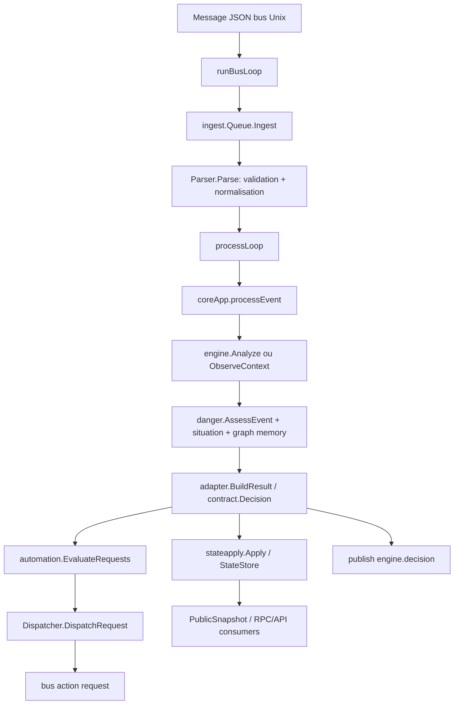
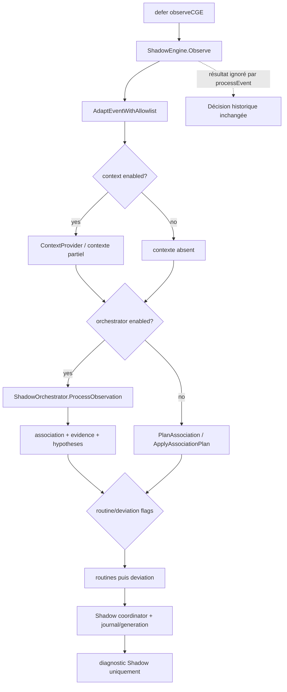
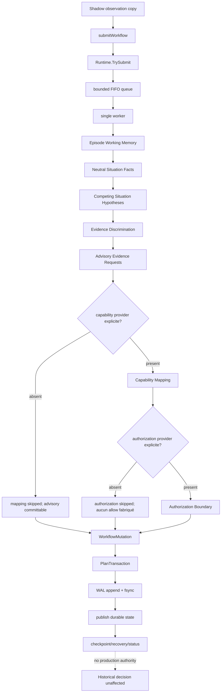
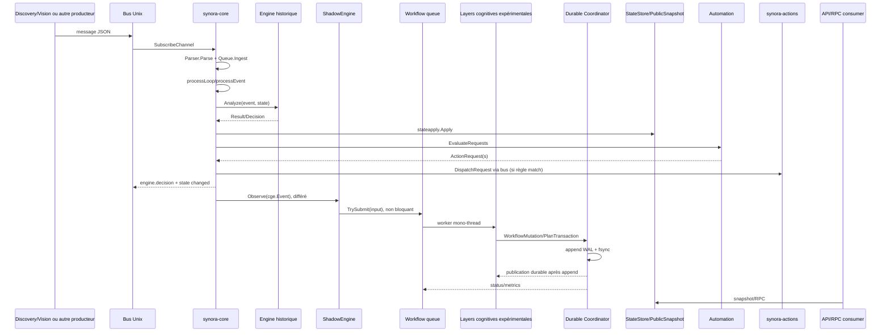

# Passe 50 — Reconnaissance complète du CGE de l’observation à la décision

## Périmètre et preuve

Cette passe est un audit du code présent au commit `dd3ae620cf8dc93a87dccce8af40e63e2c8d869`.
Elle n’ajoute aucune règle, aucun score, aucune intégration et aucun comportement.
Les références ci-dessous sont des chemins relatifs au dépôt, suivis d’une fonction
ou méthode et, lorsque utile, d’une plage de lignes observée.

Le dépôt ne contient pas `cmd/synora-lab`. Le fichier installé
`/etc/synora/cge_critical_chains.yaml` n’était pas lisible dans l’environnement
d’audit ; le parser, le fichier d’exemple et les tests ont été inspectés.

## Réponse courte : comment Synora passe aujourd’hui d’un événement à une décision ?

1. Un message JSON arrive au bus Unix et `coreApp.runBusLoop` le route vers la
   file d’ingestion (`internal/bus/client.go`, `Client.readLoop`; `cmd/synora-core/main.go`,
   `runBusLoop`, lignes 346–370).
2. `ingest.Queue.Ingest` appelle `Parser.Parse`, valide le JSON, normalise les
   champs de contrat et place l’événement dans une file haute ou normale sans
   bloquer (`internal/ingest/ingest.go`, `Parser.Parse`, lignes 23–80, et
   `Queue.Ingest`, lignes 162–203).
3. `processLoop` consomme les files et appelle synchroniquement
   `coreApp.processEvent` (`cmd/synora-core/main.go`, lignes 382–395).
4. `processEvent` convertit l’événement vers le DTO CGE, touche l’état de
   périphérique, puis appelle `engine.Analyze` ou `engine.ObserveContext`
   (`cmd/synora-core/main.go`, lignes 398–446).
5. `engine.Analyze` normalise, apprend dans la mémoire de graphe, applique les
   comportements approuvés, calcule `danger.AssessEvent`, exécute l’analyse de
   situation et construit `adapter.Result` (`internal/engine/engine.go`,
   `Engine.Analyze`; `internal/engine/danger/danger.go`, `AssessEvent`).
6. `adapter.BuildResult` transforme le niveau historique en `contract.Decision`
   et en projections d’état (`internal/engine/adapter/adapter.go`,
   `BuildResult`, lignes 174–201).
7. `stateapply.Apply` écrit les projections dans le `state.Store`; le core évalue
   ensuite les automations et expédie éventuellement des `ActionRequest` via le
   bus (`internal/stateapply/stateapply.go`, `Apply`; `internal/automation/engine.go`,
   `EvaluateRequests`; `internal/automation/dispatch.go`, `DispatchRequest`).
8. Le core publie `engine.decision`, les changements d’état et les snapshots
   (`cmd/synora-core/main.go`, `processEvent`, lignes 447–582, et `publishEvent`).
9. En parallèle différé, `observeCGE` envoie une copie scalarisée au Shadow CGE
   (`cmd/synora-core/main.go`, `observeCGE`; `internal/cge/event_adapter.go`,
   `EventFromContract`). Le nouveau Shadow Workflow reçoit ensuite une copie
   expurgée par `TrySubmit`; son résultat n’est pas consulté par la décision
   (`internal/cge/shadow_workflow_adapter.go`, `submitWorkflow`).

## Trois chemins et leurs autorités

| Chemin | Entrée | Sortie | Autorité |
| --- | --- | --- | --- |
| Historique décisionnel | `contract.Event` après ingestion | `contract.Decision`, état, automations/actions | Seul chemin qui décide et peut publier une demande d’action |
| Shadow CGE historique | `cge.Event` scalarisé | diagnostics, chaînes/associations/routines/déviation et journal Shadow | Aucune autorité sur la décision historique |
| Shadow Cognitive Workflow | `ShadowWorkflowInput` expurgé | état durable multi-couches, WAL, status et qualification | Aucune autorité, aucune autorisation exécutable, aucune action |

## Call graph réel

```text
bus.Client.readLoop
  -> coreApp.runBusLoop
    -> ingest.Queue.Ingest
      -> ingest.Parser.Parse
      -> highQueue/normalQueue (non bloquant à la saturation)
    -> coreApp.processLoop
      -> coreApp.processEvent
        -> cge.EventFromContract
        -> stateapply.TouchDeviceState
        -> adapter.NormalizeEvent / engine.Analyze
          -> adapter.NormalizeEvent
          -> graphMemory.LearnEvent
          -> cognitive.ProcessEvent
          -> graphMemory.MatchApprovedBehavior
          -> danger.AssessEvent / ComputeDangerScore
          -> situation.Analyze
          -> adapter.BuildResult / ToSynoraDecision
        -> stateapply.Apply
        -> automation.EvaluateRequests
        -> automation.Dispatcher.DispatchRequest
        -> publishEvent("engine.decision")
        -> chains.Process / dangerRuntime.Recompute / snapshot
        -> defer coreApp.observeCGE
          -> ShadowEngine.Observe
            -> AdaptEventWithAllowlist
            -> optional context
            -> optional ShadowWorkflow.TrySubmit
            -> optional ShadowOrchestrator.ProcessObservation
              -> association / evidence / hypotheses
              -> routines / deviation when configured
            -> durable Shadow journal/generation state
              -> ShadowWorkflow queue
                -> episode -> facts -> hypotheses -> discrimination
                -> advisory -> optional mapping -> optional authorization
                -> durableworkflow Coordinator.Commit
                  -> WAL append/fsync -> publish immutable state
```

Les appels du core historique sont synchrones dans `processEvent`. La file
ingestion et le bus sont asynchrones. `observeCGE` est différé par `defer`, mais
son appel à `CognitiveEngine.Observe` est réalisé avant le retour de
`processEvent`; le nouveau `TrySubmit` est non bloquant et le worker du workflow
est asynchrone.

## Diagramme A — chemin historique décisionnel



`ObserveContext` est le chemin spécial des événements de contexte : il met à
jour la mémoire de graphe et renvoie un état minimal ; il ne lance pas la même
évaluation danger/action que `Analyze` (`internal/engine/engine.go`,
`Engine.ObserveContext`).

## Diagramme B — Shadow CGE historique



Le résultat Shadow est stocké comme diagnostic (`LastOrchestrationResult`,
`LastDeviationAssessment`, métriques et snapshots), jamais comme entrée de
`contract.Decision` (`internal/cge/shadow.go`, méthodes de diagnostic).

## Diagramme C — nouveau Shadow Cognitive Workflow



## Diagramme de séquence



La soumission au workflow n’est pas un retour d’erreur vers le core
historique. Une erreur de queue, de stage ou de durabilité est isolée dans le
runtime expérimental et peut seulement affecter son status.

## Entrée, transport, validation et normalisation

### Ce qui est prouvé

- Le service de traitement est `cmd/synora-core`; il consomme le canal
  `core` de `internal/bus.Client` (`cmd/synora-core/main.go`, `runBusLoop`).
- Le transport local est une connexion Unix ligne JSON (`internal/bus/client.go`,
  `NewClient`, `readLoop`, `Send`). Le scanner de lecture est borné à 1 MiB et
  les messages entrants sont placés dans un canal de capacité 100.
- Le type entrant est `pkg/contract.Message`; après parsing, le type est
  `pkg/contract.Event` (`internal/ingest/ingest.go`, `Parser.Parse`).
- `Parser.Parse` rejette le JSON invalide, exige une source non vide, normalise
  le type, la source, le timestamp, la priorité, l’appareil, le nœud,
  l’identité, la confiance et les clés de continuité. Un `event_id` fourni est
  conservé; sinon un identifiant `evt` est généré.
- Le payload de contrat reste un `map[string]any` dans l’événement historique.
  La boundary CGE `EventFromContract` ne copie pas ce payload : elle copie
  seulement les champs scalaires `ID`, type, source, temps, device/node,
  identity, confidence, priority, group/track/clip/activation/sequence
  (`internal/cge/event_adapter.go`, `EventFromContract`).
- Un timestamp manquant est complété dans `Parser.resolveTimestamp` avec
  l’horloge injectée du parser ou `time.Now`; `adapter.NormalizeEvent` a aussi
  un fallback `time.Now` (`internal/ingest/ingest.go`, `resolveTimestamp`;
  `internal/engine/adapter/adapter.go`, `NormalizeEvent`). Ce n’est donc pas
  un chemin de déterminisme pur.
- La file ingestion utilise des envois non bloquants. Une file pleine rejette
  et journalise; il n’y a pas de retry implicite (`internal/ingest/ingest.go`,
  `Queue.Ingest`).

### Champs obligatoires, ignorés et sensibles

Obligatoires au niveau parser : JSON valide et `Source` non vide. Le type peut
être normalisé depuis plusieurs alias; le timestamp et l’ID peuvent être
complétés. Les champs inconnus du payload ne sont pas rejetés par ce parser et
peuvent rester dans l’événement historique. Ils ne franchissent pas
`EventFromContract`. Les images, audio, embeddings, biométrie brute, secrets
et corps d’événement ne sont pas présents dans `ShadowWorkflowInput`
(`internal/cge/shadow_workflow_adapter.go`, `submitWorkflow`, et
`internal/cge/shadowworkflow/input.go`, `ShadowWorkflowInput.Validate`).

Les messages JSON invalides, sans source, ou refusés par le rate controller sont
rejetés; les envois de queue saturée sont perdus côté ingestion. Un événement
avec le même `event_id` est idempotent au niveau épisodes/workflow lorsqu’il
atteint ce chemin, mais un rejet de queue n’est pas une livraison durable.

## CGE historique : contexte, chaînes, associations, routines et déviation

### Appel et état

`ShadowEngine.observeRuntime` est déclenché depuis `ShadowEngine.Observe` et
protégé par récupération de panic (`internal/cge/shadow_runtime.go`,
`observeRuntime`). Il adapte l’événement avec une allowlist; les événements
malformés ou non éligibles sont comptabilisés et ignorés. Les événements
éligibles sont traités par `ShadowOrchestrator.ProcessObservation` lorsque
`Cognitive.Enabled`; sinon le chemin association-only planifie et applique
`PlanAssociation`/`ApplyAssociationPlan` (`internal/cge/shadow_runtime.go`,
`observeRuntime`).

Le Shadow historique lit son `durable.Coordinator`, son journal et ses
policies association/evidence. Il persiste des mutations dans son propre
journal/generation store. Il ne modifie ni `state.Store`, ni `contract.Decision`.

### Contexte

Le contexte Shadow est construit par `ContextProvider` lorsque
`ShadowContextConfig.Enabled`; il peut être statique et partiel, avec timezone
et `AllowPartial` (`internal/cge/shadow_runtime.go`, construction du provider;
`internal/cge/context`). Un contexte manquant, partiel, une topologie absente
ou une source indisponible sont des états descriptifs distincts des
contradictions; les détails sont dans `internal/cge/context/model.go` et
`context/quality.go`. Le core historique possède en parallèle un contexte de
danger (`internal/engine/danger.Context`) qui contient nœud, rôle, bucket
temporel, mode maison, présence, répétition et flags de profil.

### Chaînes ordinaires et associations

Une chaîne ordinaire est une mémoire d’événements liée par la logique de
`internal/event/chains.go`, tandis qu’une association Shadow utilise
`internal/cge/chains/association`. L’association compare identité/sujet,
track, activation, séquence, clip, nœud/zone, topologie, chaîne, routine et
contexte selon `internal/cge/episodes/scoring.go`, `scoreCandidate` et
`internal/cge/episodes/planner.go`, `PlanIngest`. Les décisions d’épisode sont
`attach_existing`, `create_episode`, `ambiguous`, `duplicate`, `rejected`.

Une identité connue différente est un rejet dur; un sujet inconnu n’est pas
forcé vers un résident; une identité incertaine peut conserver plusieurs
candidats. L’ambiguïté ne produit pas une association forcée. Les observations
sont triées par temps puis ID; une observation tardive peut être acceptée dans
la grâce de policy, sinon elle est rejetée. Les limites par défaut sont
documentées dans `internal/cge/README_PASS38_EPISODE_WORKING_MEMORY.md`.

Les chaînes ont des statuts/lifecycles dans `internal/event/chains.go` et
`internal/cge/chains/lifecycle`; elles peuvent être ouvertes, mises à jour,
fermées/quiescentes ou archivées selon le manager historique. Les APIs de
fusion/division/invalidation doivent être lues dans le manager concerné; elles
ne constituent pas un appel au nouveau workflow. Les fingerprints et
snapshots du Shadow sont définis dans `internal/cge/chains/generations` et les
domaines de chaîne.

### Chaînes critiques : résultat exact

Le fichier configurable est `SYNORA_CGE_CRITICAL_CHAINS`, avec défaut
`/etc/synora/cge_critical_chains.yaml` et repli de développement
`configs/cge_critical_chains.yaml` (`cmd/synora-core/main.go`,
`loadCGECriticalChains` et `cgeCriticalChainsPath`, lignes 1351–1360).

Le loader réel est `internal/engine/graph/critical.go`, `LoadCriticalSeeds`.
Il décode YAML avec `KnownFields(true)` dans une structure dont le champ est
`critical_chains`, puis `NormalizeCriticalSeeds`. La validation exige ID, nom,
score dans `[0,1]`, score minimal `0.65` par défaut, risk level, expected state,
séquence et actions autorisées; les IDs dupliqués sont refusés.

Le moteur charge ces seeds au démarrage (`cmd/synora-core/main.go`, lignes
131–144) dans `Engine.LoadCriticalSeeds` puis `GraphMemory.ReplaceCriticalSeeds`
(`internal/engine/engine.go`, lignes 152–224; `internal/engine/graph/critical.go`,
`ReplaceCriticalSeeds`). Elles sont stockées en mémoire dans `criticalSeeds` et
représentées comme séquences apprises d’origine `critical_seed`.

Elles interviennent réellement dans `Engine.Analyze`: `graphMemory.LearnEvent`
peut produire un `CriticalSeedMatch`; `applyCriticalSeedMatch` augmente le
niveau/score d’assessment, ajoute l’ID dans les preuves/raisons et influence la
construction de `DecisionResult` (`internal/engine/engine.go`, `Analyze` et
`applyCriticalSeedMatch`, lignes 53–86 et 724–765). Elles influencent donc
**l’évaluation historique, le niveau/score, les preuves/raisons et la décision
historique**. Elles ne sont pas seulement stockées. Elles ne sont pas une
simple priorité de surveillance.

Les seeds peuvent aussi porter des `ProposedActions`, mais la validation
interdit les actions non autorisées; le chemin observé de la décision reste
`engine.Analyze` puis l’évaluation automation de `coreApp`. Le code audité ne
montre pas que le YAML critique appelle directement `actions`; il contribue à
la décision/assessment, puis une automation approuvée peut éventuellement
produire un `ActionRequest`. Ce n’est pas une invocation directe du seed.

Fichier absent : `LoadCriticalSeedsFirstExisting` essaie les chemins puis le
core logue l’absence (`internal/engine/engine.go`, `LoadCriticalSeedsFirstExisting`;
`cmd/synora-core/main.go`, lignes 138–144). Fichier invalide : l’erreur est
loguée comme warning au démarrage. Fichier vide : il se normalise en ensemble
vide si le YAML est structurellement valide. Aucun fingerprint de fichier
critique n’a été trouvé dans le fingerprint global de configuration du core;
la structure est chargée par l’engine et sa persistence est gérée par le
fichier YAML/backup (`internal/engine/graph/critical.go`, `SaveCriticalSeeds`).

Conclusion A–F : les chaînes critiques sont **B, C, D et E** : chargées et
stockées; utilisées pour influencer le suivi/matching; utilisées pour le
score/assessment; utilisées pour la décision. Elles ne sont pas une action
directe **F**.

### Routines

Le Shadow apprend des routines seulement lorsque
`ShadowRoutineConfig.Enabled` et qu’un chain ID est disponible; l’appel est
`learnRoutines` dans `internal/cge/shadow_runtime.go`, qui délègue à
`internal/cge/routines`. Les événements de chaîne et transitions alimentent
les fenêtres temporelles, buckets, gap maximal et exigence de topologie. Une
routine confirmée est un motif suffisamment récurrent selon la policy de
routine; elle reste une référence descriptive dans chaîne/épisode. La
déviation est évaluée autour de ce motif selon les fenêtres configurées; le
code appelle la routine et l’évaluation dans l’ordre du Shadow, sans relancer
la décision historique (`internal/cge/shadow_routines.go` et
`internal/cge/shadow_deviation.go`).

Les fenêtres par défaut visibles dans `DefaultShadowConfig` sont bucket 15
minutes, gap 15 minutes, contexte partiel autorisé et même révision de
topologie requise (`internal/cge/shadow_config.go`, lignes 113–125). Un
changement de routine est une nouvelle version/transition de motif; il ne
produit pas directement une décision.

### Déviation

`internal/cge/deviation` représente une assessment descriptive. Le Shadow
limite les assessments récentes et par observation via
`ShadowDeviationConfig`; les facteurs temporel, spatial, contexte, intervalle
et coverage sont assemblés par `internal/cge/shadow_deviation.go` et les
fonctions du package `deviation`. Un score est borné par la policy de déviation
et une coverage insuffisante est distinguée d’une valeur alignée à zéro, d’une
donnée absente et d’une déviation positive.

La déviation est observée dans le diagnostic Shadow, et l’épisode ne la
recalcule pas : il en conserve une `DeviationRef` (`internal/cge/episodes/model.go`,
`DeviationRef`; `episodes/observation.go`). Dans les couches 38–49, elle ne
modifie pas directement la décision historique. Le score décisionnel
historique vient de `danger.ComputeDangerScore`, des critical seeds, du
contexte de danger, des chaînes historiques et du runtime danger, pas du
Shadow Workflow (`internal/engine/danger/danger.go`, `ComputeDangerScore`; 
`internal/cge/danger_runtime.go`, `Recompute`).

## Couches expérimentales 38–45

### Episode Working Memory

`episodes.BuildObservationRef` reçoit une sortie CGE existante et fabrique une
référence expurgée; `PlanIngest` calcule attach/create/ambiguous/duplicate/
rejected sans mutation ni horloge; `Registry.ApplyIngestPlan` publie sous
révision et clone défensif (`internal/cge/episodes/observation.go`,
`planner.go`, `registry.go`). L’ID est dérivé de policy, premier EventID,
temps et sujet (`episodes/fingerprint.go`/`planner.go`). Le runtime actuel ne
consomme pas ce package directement : c’est `shadowworkflow.pipeline` qui le
fait (`internal/cge/shadowworkflow/pipeline.go`, `planEpisode`).

### Neutral Situation Facts

`situationfacts.Extract` reçoit un épisode et un temps explicite. Il émet des
faits observed, derived ou carried, avec valeurs typées, qualité, provenance,
conflits et statuts `asserted`, `unknown`, `conflicting`, `retracted`
(`internal/cge/situationfacts/extractor.go`, `schema.go`, `snapshot.go`). Les
faits couvrent temporalité, spatialité, identité/sujets, continuité,
contexte, transitions et références de routine/déviation. Les termes
interprétatifs sont refusés par `containsForbiddenNeutralTerm`. Une extraction
ne produit pas de décision.

### Competing Situation Hypotheses

`situationhypotheses.Evaluate` consomme uniquement FactSet et schéma. Les kinds
réels v1 sont `pattern_consistent`, `isolated_deviation`,
`possible_pattern_shift`, `identity_resolution_failure`,
`coherent_unrecognized_activity`, `context_or_sensor_inconsistency`,
`multi_entity_activity`, `insufficient_information` (`schema.go`). Les règles
typées ajoutent support/contradiction/coverage/missing requirements. La
`PlausibilityPermille` est un indice descriptif, pas une probabilité. Le
leader reste vide sous la marge minimale; plusieurs hypothèses sont conservées
(`internal/cge/situationhypotheses/evaluator.go`, `scoring.go`, `planner.go`).
Cette couche n’a aucune autorité de production.

### Evidence Discrimination

`evidencediscrimination.Analyze` compare le FactSet et les hypothèses; son
catalogue décrit les dimensions et résultats potentiels. Il calcule
discrimination, coverage gain, redundancy et utility, puis conserve des
`EvidenceCandidate` classés (`internal/cge/evidencediscrimination/analyzer.go`,
`catalog.go`, `planner.go`). Il ne commande aucune observation et ne produit
aucun appel matériel.

### Advisory Evidence Requests

`advisoryrequests.Plan` transforme des candidats assez utiles en demandes
consultatives. `AdvisoryRequestKey` est stable par épisode/kind/dimension/facts/
paires; `AdvisoryRequestID` incorpore la génération. Les statuts sont proposés,
acknowledged, deferred, suppressed, satisfied, expired, cancelled et
invalidated; les quatre derniers sont terminaux selon le lifecycle
(`internal/cge/advisoryrequests/model.go`, `planner.go`, `lifecycle.go`).
Déduplication, TTL, suppression, acknowledge/defer/cancel et nouvelles
générations sont administratifs. Une demande n’est pas une commande.

### Capability Mapping

`capabilitymapping.BuildRequirement` dérive les kinds abstraits depuis la
requête. `Analyze` évalue contre un `CapabilityCatalog` et un
`CapabilityInventory` explicitement fournis : kind, statut, qualité,
contraintes, scope, disponibilité, coût, latence et sensibilité
(`internal/cge/capabilitymapping/requirement.go`, `compatibility.go`,
`planner.go`). `PreferredCandidateID` est la meilleure correspondance
descriptive avec marge suffisante, pas une sélection. Aucun provider matériel
réel n’existe dans le câblage Shadow actuel; les providers synthétiques sont
utilisés par les tests seulement.

### Authorization Boundary

`authorizationboundary.Analyze` consomme uniquement un mapping, un contexte,
un policy set et un grant snapshot. La précédence codée distingue invalide,
obsolete, deny explicite, confirmation, defer, allow eligibility et default
deny (`internal/cge/authorizationboundary/evaluator.go`, `precedence.go`).
Les grants sont contrôlés pour validité temporelle, révocation, finalité,
capability kind, scope, domaine et issuer (`grant.go`). `eligible` signifie
seulement que la correspondance satisfait la policy fournie pour une future
autorisation; aucun token ni grant d’exécution n’est produit.

## Workflow durable

`durableworkflow.WorkflowState` stocke les snapshots publics par épisode et les
résultats compacts des sept couches. `lineage.ValidateState` vérifie les
relations Episode→Facts→Hypotheses→Discrimination→Advisory→Mapping→Authorization;
une mise à jour amont rend les descendants `stale`, sauf remplacement cohérent
dans la même mutation (`internal/cge/durableworkflow/lineage.go`,
`freshness.go`).

`PlanTransaction` est pur et prépare un état résultant. `Coordinator.Commit`
verrouille, vérifie révision/digest, recalcule l’état temporaire, vérifie le
digest, appelle `Store.Append`, synchronise selon policy, puis publie l’état
(`internal/cge/durableworkflow/coordinator.go`, `Commit`).

Le durable workflow expérimental possède un WAL NDJSON versionné avec records
`genesis`, `transaction`, `checkpoint_marker`, longueur, fingerprint et
checksum SHA-256 (`durableworkflow/record.go`, `codec.go`, `file_store.go`). Le
replay vérifie genesis, checkpoint, sequences, transaction IDs, filiations et
recalcule les digests (`durableworkflow/replay.go`). Une troncature finale est
optionnelle selon policy; une corruption intermédiaire, un gap, une collision
ou un checksum incorrect sont fatals. Le checkpoint est écrit temporairement,
fsyncé, renommé atomiquement puis le répertoire est synchronisé
(`durableworkflow/checkpoint.go`). Ce WAL est distinct du journal historique
Shadow (`internal/cge/shadow_runtime.go`, `openShadowCoordinator`) et aucun
format de production n’est modifié.

## Shadow Workflow intégré

`internal/cge/shadow_workflow_adapter.go`, `submitWorkflow`, construit une
`episodes.ObservationRef` à partir de l’observation Shadow et l’envoie dans
`shadowworkflow.ShadowWorkflowInput` avec révision et fingerprint du journal.
La ligne `_ = e.workflow.TrySubmit(input)` prouve que le résultat est ignoré.

Le runtime a une queue bornée, un worker, un coordinateur durable, des quotas,
timeouts, circuit breaker `closed/open/half_open`, status et métriques
(`internal/cge/shadowworkflow/runtime.go`, `queue.go`, `breaker.go`,
`status.go`). Le pipeline par défaut est `advisory_requests`; les providers
capability/authorization sont nil dans `NewShadowEngineWithConfig`, donc les
couches aval sont absentes ou skipped, sans inventaire/grant fabriqué
(`internal/cge/shadow_runtime.go`, construction du runtime; `shadowworkflow/pipeline.go`,
`process`).

Le cycle est assemblé dans une mutation et committe en un seul record. La
séquence vient du `WorkflowState.LastSequence`; l’ID est dérivé de EventID,
EpisodeID, révisions et profondeur (`shadowworkflow/pipeline.go`, `transactionID`).
La queue n’est pas persistée : une entrée acceptée mais non commitée peut être
perdue lors d’un crash. Une recovery échouée refuse l’acceptation du workflow
mais laisse le Shadow historique fonctionner.

## Qualification physique et instrumentation

La passe 49 ajoute un recorder local dans `internal/cge/shadowworkflow` :
configuration désactivée par défaut, samples NDJSON bornés, summary/manifest
atomiques, métriques processus/stages/storage/queue, reporter offline et gates
(`qualification_config.go`, `qualification_recorder.go`, `qualification_report.go`,
`qualification_readiness.go`). Les fichiers sont locaux et redacted; aucune
 télémétrie distante, endpoint ou modification de décision n’est introduite.
La qualification physique et la stabilité multi-jour restent non prouvées.

## Définition réelle de la décision — What currently decides?

### Type, constructeur et entrées

Le type de décision est `pkg/contract.Decision`. Il contient ID/type/source/time,
priorité, EventID, score/effective score, alert, reason, state/node, danger
level/score/source, références clip/track/group/sequence, `GraphUsed`,
validation et champs d’action (`pkg/contract/decision.go`, lignes 8–43).

La décision est construite par `internal/engine/adapter/adapter.go`,
`ToSynoraDecision`, depuis `cgecontracts.DecisionResult`, puis enrichie par
`BuildResult` avec `DangerAssessment`. Les entrées réelles sont le type
d’événement normalisé, confiance, nœud/rôle, temporal bucket, mode maison,
présence, répétition/sequence novelty, profil sécurité, chaînes/graph memory,
critical seeds, et les règles de `danger.ComputeDangerScore`.

### Seuils et transitions

Les niveaux sont calculés par les branches de `internal/engine/danger/danger.go`,
`ComputeDangerScore` : `levelForScore` utilise 0.18, 0.35, 0.55, 0.75 et 0.90;
les événements ont aussi des branches explicites, par exemple unknown à 0.48,
unknown entrée à 0.62, unknown nuit à 0.82, weapon à 0.95 et fall à 0.92.
Les états adapter sont `idle`, `activity`, `suspicious`, `intrusion`; le
danger runtime ajoute `emergency` pour urgence médicale et applique decay,
hysteresis et verrou (`internal/cge/danger_runtime.go`, `Recompute` et
`applyHysteresis`).

Le verrou temporel est `LockIntrusionUntilReset` dans `DangerDecayConfig`;
une contribution critique ou un état intrusion/urgence verrouillé maintient
un niveau critique et l’état intrusion jusqu’au reset. Le reset explicite est
géré par les RPC de mode/risque (`internal/rpc/security_mode.go`). Une arme
ou une chute produisent une évaluation immédiate de niveau 5 dans
`ComputeDangerScore`; unknown à l’entrée ou la nuit produit des niveaux élevés
mais pas nécessairement intrusion immédiate. La configuration exacte vient de
`contract.DefaultDangerDecayConfig`/security profile et du state courant.

### Après la décision

`stateapply.Apply` persiste projections, danger assessment, validation et
system state dans `state.Store`. `coreApp.processEvent` évalue
`automation.EvaluateRequests` selon trigger, score effectif, conditions,
schedule, validation et cooldown (`internal/automation/engine.go`, lignes
226–310). Les requêtes produites sont envoyées comme messages `KindCommand`
`EventActionRequest` à la cible `actions` par `Dispatcher.DispatchRequest`
(`internal/automation/dispatch.go`, lignes 83–151).

`cmd/synora-actions/main.go` accepte ces commandes et `internal/actions/service.go`
les décode, route et exécute via `internal/actions/router.go`/adapters; le
résultat revient comme événement d’action. Le core publie `engine.decision`
et l’état, et `contract.PublicSnapshotFromCoreState` expose notamment system,
events, actions, metrics et CGE (`pkg/contract/public_snapshot.go`). Le CGE
Shadow historique et le nouveau workflow ne font pas d’appel direct à
`internal/actions`.

## Tableau maître du pipeline

| Ordre | Domaine | Fichier | Fonction | Entrée → sortie | Lit | Modifie/persisté | Sync/async | Flag | Échec | Autorité |
| ---: | --- | --- | --- | --- | --- | --- | --- | --- | --- | --- |
| 1 | Ingress | `internal/bus/client.go` | `readLoop` | ligne JSON → `Message` | socket Unix | canal entrant | async goroutine | service | decode/overflow logué ou drop | aucune |
| 2 | Routage | `cmd/synora-core/main.go` | `runBusLoop` | `Message` → `Ingest`/RPC | canal bus | file ingestion/RPC | sync dans loop | core | message inconnu logué | aucune |
| 3 | Normalisation | `internal/ingest/ingest.go` | `Parser.Parse` | `Message` → `contract.Event` | payload/device registry | événement en mémoire | sync | ingestion | invalid JSON/source/rate reject | aucune |
| 4 | Queue core | `internal/ingest/ingest.go` | `Queue.Ingest` | Event → high/normal queue | rate policy | channel borné | non bloquant | core | queue full drop | aucune |
| 5 | Décision | `cmd/synora-core/main.go` | `processEvent` | Event → Result/Decision | state, engine, flags | état et événement | sync worker | historique | erreurs branchées/loguées | oui |
| 6 | Scoring | `internal/engine/engine.go` | `Analyze` | Event/state → `Result` | graph, situation, profile | graph learning | sync | engine | résultat/validation | oui |
| 7 | Danger | `internal/engine/danger/danger.go` | `AssessEvent` | event/context → assessment | context | aucune puis Result | sync | profile/context | assessment descriptif | oui via Result |
| 8 | State | `internal/stateapply/stateapply.go` | `Apply` | Result → Store | result | StateStore | sync | core | partial branches par champ | oui |
| 9 | Automation | `internal/automation/engine.go` | `EvaluateRequests` | event/decision → requests | rules/cooldowns | cooldowns | sync | automation config | rule skip/log | aucune, mais produit demande |
| 10 | Action bus | `internal/automation/dispatch.go` | `DispatchRequest` | request → command Message | request | bus | sync send | automation/action | send error mutates blocked decision | non, action service |
| 11 | Publication | `cmd/synora-core/main.go` | `publishEvent` | decision/state → bus | payload | bus | sync send | core | logged | expose résultat |
| 12 | Shadow historique | `internal/cge/shadow_runtime.go` | `observeRuntime` | CGE Event → Shadow result | journal/coordinator/policies | Shadow journal/diagnostic | deferred call | `SYNORA_CGE_SHADOW_ENABLED` et sous-flags | logged/isolated | non |
| 13 | Workflow submit | `internal/cge/shadow_workflow_adapter.go` | `submitWorkflow` | Observation → `ShadowWorkflowInput` | Shadow journal status | queue via `TrySubmit` | non bloquant | workflow flag | result ignoré | non |
| 14 | Workflow stages | `internal/cge/shadowworkflow/pipeline.go` | `process` | input → mutation | durable state/providers | mutation temporaire | worker async | depth | cycle sans commit | non |
| 15 | Durable | `internal/cge/durableworkflow/coordinator.go` | `Commit` | transaction → state | revision/digest | WAL puis state | mono-writer | store mode | commit/recovery error | non |
| 16 | API/public | `pkg/contract/public_snapshot.go` | `PublicSnapshotFromCoreState` | core map → public snapshot | state map | aucun | appelé par consumer | API/RPC | mapping absent | lecture |
| 17 | Actions | `internal/actions/service.go` | `Handle`/route | command → execution result | bus/router | action side effects | service async | actions config | error result | effet physique éventuel |

## Matrice d’autorité

| Composant | Observe | Apprend | Évalue | Recommande | Décide | Autorise | Exécute |
| --- | ---: | ---: | ---: | ---: | ---: | ---: | ---: |
| Core historique | oui | oui | oui | oui | oui | non | non direct |
| Shadow CGE historique | oui | oui, graph/routines | oui, descriptif | oui, evidence | non | non | non |
| Episode Working Memory | oui, refs | non | attach descriptif | non | non | non | non |
| Situation Facts | non | non | extrait facts | non | non | non | non |
| Situation Hypotheses | non | non | hypothèses concurrentes | non | non | non | non |
| Evidence Discrimination | non | non | utilité preuve | oui | non | non | non |
| Advisory Requests | non | lifecycle administratif | pertinence | oui | non | non | non |
| Capability Mapping | non | non | compatibilité | oui | non | non | non |
| Authorization Boundary | non | non | éligibilité | non | non, eligibility only | non | non |
| Durable Workflow | non | non | filiation/fraîcheur | non | non | non | non |
| Shadow Workflow Runtime | copie expurgée | orchestration des layers | pipeline | non | non | non | non |
| Automation Engine | événement/décision | cooldown | conditions | request action | non | policy automation | non |
| Actions Service | commande | non | route/execution result | non | non | non | oui, via adapters |

## Matrice des feature flags

Les variables ci-dessous sont celles trouvées par recherche et lecture du
parser; les valeurs par défaut viennent de `DefaultShadowConfig` et des
loaders concernés (`internal/cge/shadow_config.go`, `fieldtrial/config.go`,
`shadowworkflow/qualification_config.go`).

| Variable | Défaut | Lue dans | Effet |
| --- | --- | --- | --- |
| `SYNORA_CGE_SHADOW_ENABLED` | false | `LoadShadowConfig` | crée/active Shadow historique |
| `SYNORA_CGE_DATA_DIR` | `/var/lib/synora/cge` | `LoadShadowConfig` | chemin Shadow historique |
| `SYNORA_CGE_JOURNAL_PATH` | data dir + `journal.ndjson` | `LoadShadowConfig` | journal historique |
| `SYNORA_CGE_INITIALIZE_IF_MISSING` | false | `LoadShadowConfig` | initialise le journal absent |
| `SYNORA_CGE_JOURNAL_ID` | vide sauf initialisation explicite | `LoadShadowConfig` | identité journal |
| `SYNORA_CGE_CRITICAL_CHAINS` | `/etc/synora/cge_critical_chains.yaml` | `cgeCriticalChainsPath` | fichier critical seeds |
| `SYNORA_CGE_PROFILE` | `configs/cge_profile.yaml` ou constante de démarrage | `cmd/synora-core/main.go` | security profile historique |
| `SYNORA_CGE_FEEDBACK` | chemin feedback par défaut | `cmd/synora-core/main.go` | feedback historique |
| `SYNORA_CGE_DEBUG` | false | `cmd/synora-core/main.go` | debug du `DangerRuntime` |
| `SYNORA_CGE_SHADOW_COGNITIVE_ENABLED` | false | `LoadShadowConfig` | orchestrateur cognitif Shadow |
| `SYNORA_CGE_SHADOW_AUTO_EVIDENCE_ENABLED` | false | `LoadShadowConfig` | application automatique de evidence Shadow |
| `SYNORA_CGE_SHADOW_MAX_EVIDENCE_REEVALUATIONS` | 8 | `LoadShadowConfig` | borne des réévaluations |
| `SYNORA_CGE_SHADOW_CONTEXT_ENABLED` | false | `LoadShadowConfig` | provider contexte Shadow |
| `SYNORA_CGE_SHADOW_CONTEXT_TIMEZONE` | UTC | `LoadShadowConfig` | timezone contexte |
| `SYNORA_CGE_SHADOW_CONTEXT_ALLOW_PARTIAL` | true | `LoadShadowConfig` | contexte partiel |
| `SYNORA_CGE_SHADOW_ROUTINE_LEARNING_ENABLED` | false | `LoadShadowConfig` | apprentissage routines |
| `SYNORA_CGE_SHADOW_ROUTINE_TEMPORAL_BUCKET_MINUTES` | 15 | `LoadShadowConfig` | fenêtre bucket |
| `SYNORA_CGE_SHADOW_ROUTINE_ALLOW_PARTIAL` | true | `LoadShadowConfig` | contexte partiel routine |
| `SYNORA_CGE_SHADOW_ROUTINE_MAX_TRANSITION_GAP` | 15m | `LoadShadowConfig` | gap routine |
| `SYNORA_CGE_SHADOW_ROUTINE_REQUIRE_SAME_TOPOLOGY_REVISION` | true | `LoadShadowConfig` | topologie routine |
| `SYNORA_CGE_SHADOW_DEVIATION_ENABLED` | false | `LoadShadowConfig` | évaluation déviation |
| `SYNORA_CGE_SHADOW_DEVIATION_RECENT_LIMIT` | 256 | `LoadShadowConfig` | assessments conservées |
| `SYNORA_CGE_SHADOW_DEVIATION_MAX_ASSESSMENTS_PER_OBSERVATION` | 2 | `LoadShadowConfig` | borne par observation |
| `SYNORA_CGE_SHADOW_WORKFLOW_ENABLED` | false | `LoadShadowConfig`/workflow | nouveau workflow |
| `SYNORA_CGE_SHADOW_QUALIFICATION_ENABLED` | false | qualification loader | recorder local |
| `SYNORA_CGE_SHADOW_QUALIFICATION_RUN_ID` | vide | qualification loader | RunID redacted |
| `SYNORA_CGE_SHADOW_QUALIFICATION_PROFILE` | smoke/default profile | qualification loader | profil d’instrumentation |
| `SYNORA_CGE_SHADOW_QUALIFICATION_OUTPUT_DIR` | vide | qualification loader | répertoire obligatoire si activé |
| `SYNORA_CGE_SHADOW_QUALIFICATION_SAMPLE_INTERVAL` | 5s | qualification loader | période sample |
| `SYNORA_CGE_SHADOW_QUALIFICATION_MAX_OUTPUT_BYTES` | 512 MiB | qualification loader | borne fichiers |
| `SYNORA_CGE_FIELD_TRIAL_ENABLED` | false | `internal/cge/fieldtrial/config.go` | Field Trial Recorder |
| `SYNORA_CGE_FIELD_TRIAL_ROOT` | `/var/lib/synora/cge-field-trials` | `fieldtrial.LoadConfig` | racine Field Trial |
| `SYNORA_CGE_FIELD_TRIAL_SESSION_ID` | vide | `fieldtrial.LoadConfig` | session expurgée |
| `SYNORA_CGE_FIELD_TRIAL_SEGMENT_MAX_BYTES` | 16 MiB | `fieldtrial.LoadConfig` | taille segment |
| `SYNORA_CGE_FIELD_TRIAL_RETENTION_DAYS` | 45 | `fieldtrial.LoadConfig` | rétention |
| `SYNORA_CGE_FIELD_TRIAL_MAX_TOTAL_BYTES` | 512 MiB | `fieldtrial.LoadConfig` | quota total |
| `SYNORA_CGE_FIELD_TRIAL_SYNC_EACH_EVENT` | false | `fieldtrial.LoadConfig` | synchronisation recorder |
| `SYNORA_CGE_FIELD_TRIAL_KEY_FILE` | vide | `fieldtrial.LoadConfig` | clé de pseudonymisation |
| `SYNORA_CGE_FIELD_TRIAL_TOPOLOGY_FILE` | vide | `fieldtrial.LoadConfig` | topologie Field Trial |
| `SYNORA_CGE_FIELD_TRIAL_INCLUDE_CONTEXT` | true | `fieldtrial.LoadConfig` | catégories contexte |
| `SYNORA_CGE_FIELD_TRIAL_INCLUDE_LATENCIES` | true | `fieldtrial.LoadConfig` | breakdown latence |

## Matrice de persistence

| Domaine | État | Format/emplacement | Replay/checkpoint | Nature |
| --- | --- | --- | --- | --- |
| Chaînes historiques | chaînes et événements projetés | `StateStore`/`internal/event/chains.go` | restauration StateStore, journal/générations selon module | production historique |
| Routines/graph | learned sequences/behaviors | StateStore et structures graph | mécanismes engine/graph | production historique |
| Critical chains | YAML `critical_chains` + backups | path env ou `/etc`, exemple `configs/...` | reload startup, pas WAL durableworkflow | production historique |
| Shadow CGE | mutations chain/evidence/hypothesis | journal Shadow + generations | replay/generation | Shadow historique |
| Episodes–authorization | workflow state | `durableworkflow.FileStore`, WAL NDJSON | replay + checkpoint atomique | expérimental séparé |
| Qualification samples | samples/summary/manifest | output dir explicite, permissions 0600/0700 | reporter offline, pas workflow state | qualification locale |
| Public state | décisions/projections | `state.Store` puis snapshots | StateStore load | production historique |

Le WAL historique de `internal/cge/chains/journal` n’est pas le WAL
`durableworkflow`; aucun format historique n’a été modifié dans cette passe.

## Matrice des erreurs

| Étape | Erreur | Propagation | État partiel | Retry | Effet historique |
| --- | --- | --- | --- | --- | --- |
| Bus | decode/socket/drop | log ou canal fermé | non dans core | reconnexion bus | le message peut être perdu |
| Ingestion | JSON/source/rate/queue | reject/drop | non | non implicite | décision non produite |
| Historique | engine/state | branche/log selon core | stateapply peut avoir des branches déjà écrites | boucle suivante selon cas | peut affecter décision |
| Critical YAML | absent/invalide | warning startup | seeds précédentes/non chargées selon état | pas automatique | peut changer historique si config change |
| Shadow | malformed/degraded | métrique/log | aucun commit Shadow partiel | observation suivante | aucun effet historique |
| Workflow provider | absent | mapping/auth skipped | advisory peut committer | événement suivant | aucun effet historique |
| Workflow stage | error/timeout/panic | cycle failed/circuit | aucun commit cycle | breaker policy | aucun effet historique |
| Queue workflow | full/open/stopped | `TrySubmit` status | événement non accepté | soumission ultérieure | aucun effet historique |
| Durable WAL | append/fsync/corruption | commit/recovery failed | état précédent | recovery/config correction | Shadow historique actif |
| Checkpoint | maintenance failure | status degraded | transactions déjà durables restent | prochain checkpoint | aucun effet historique |
| Reporter | sample tronqué/fingerprint invalid | exit 3 | report incomplet | relancer hors ligne | aucun effet runtime |

## Concurrence et ownership

Le bus possède une goroutine de lecture et un canal borné; le core possède les
files high/normal/RPC et un process loop; l’ingestion envoie sans attente.
`ShadowEngine` est protégé par ses propres mutex/coordinateur et le nouveau
workflow a une queue, un worker unique et un coordinateur durable mono-writer.
Les snapshots et status sont des clones; les compteurs workflow sont atomiques.
Le recorder de qualification possède son ticker/flush seulement quand activé.

Le commit durable est la frontière atomique : aucun état workflow nouveau n’est
publié avant append/fsync. Les planners sont purs et peuvent être appelés
concurremment; l’application est sérialisée par le coordinateur. `Close` refuse
les soumissions, arrête le worker et ferme store/recorder sous contexte borné.
Deux writers de processus ne sont pas supportés. Une entrée en queue n’est pas
durable avant transaction committée.

## Tests servant de preuve

| Comportement | Package/fichier | Test identifiable | Portée |
| --- | --- | --- | --- |
| décision critique historique | `cmd/synora-core/critical_flow_test.go` | `TestCriticalFlow...` | score, state, decision/action |
| critical seeds | `internal/engine/graph/critical_test.go` | `TestCriticalSeedMatchesUnknownPersistentEntrance` | match seed |
| startup critical config | `cmd/synora-core/startup_test.go` | `TestLoadCGECriticalChainsUsesConfiguredStartupPath` | YAML → engine |
| chaînes | `internal/event/chains_test.go` | tests de chain manager | lifecycle/persistence |
| routines/déviation | `internal/cge/shadow_*_test.go` | tests Shadow routine/deviation | diagnostic Shadow |
| épisodes | `internal/cge/episodes/episodes_test.go` | `TestQualificationA...` à `O` | attach/create/ambiguous/duplicate |
| facts | `internal/cge/situationfacts/situationfacts_test.go` | `TestQualification...`, golden corpus | extraction/conflits/incrémental |
| hypothèses | `internal/cge/situationhypotheses/*_test.go` | qualification/scoring/lifecycle | compétition/leader |
| discrimination | `internal/cge/evidencediscrimination/*_test.go` | qualification tests | candidates/utility |
| advisory | `internal/cge/advisoryrequests/*_test.go` | qualification tests | lifecycle/générations |
| mapping | `internal/cge/capabilitymapping/*_test.go` | qualification tests | compatibilité/preferred |
| authorization | `internal/cge/authorizationboundary/*_test.go` | qualification tests | default deny/grants |
| durable | `internal/cge/durableworkflow/*_test.go` | replay/checkpoint/concurrency | WAL/lineage |
| workflow intégré | `internal/cge/shadowworkflow/*_test.go` | `TestAdvisoryPipelineCommitsDurableState` | queue→commit |
| isolation historique | `internal/cge/historical_isolation_test.go` | `TestShadowWorkflowGoldenHistoricalRegression` | workflow off/on identique |
| recovery workflow | `internal/cge/shadowworkflow/recovery_integration_test.go` | `TestQualification...` | corruption/truncation/fsync |
| qualification | `internal/cge/shadowworkflow/qualification_instrumentation_test.go` | `TestQualification...` | recorder/reporter/gates |

Les tests fournissent une bonne couverture des domaines expérimentaux. Le
corpus physique réel, la stabilité multi-jour et l’effet sur une Rock 5 ITX
ne sont pas des tests présents dans le dépôt.

## Zones mortes, ambiguës ou non déterminées

Recherche effectuée avec `rg` sur `TODO|FIXME|HACK|XXX`, les flags,
constructeurs et usages des packages. Les points observés sont :

- `cmd/synora-lab` est absent; aucun chemin de lancement lab ne peut être
  affirmé.
- Les providers matériels de capability mapping et d’autorisation ne sont pas
  câblés; la profondeur maximale réellement activable depuis
  `NewShadowEngineWithConfig` reste advisory sans injection de tests.
- La variable de qualification est chargée par le sous-système expérimental,
  mais son activation runtime dépend de la configuration workflow; aucun
  déploiement physique n’a été effectué.
- Les fichiers critiques sont chargés et utilisés, mais le fingerprint global
  de configuration du core n’intègre pas leur contenu de façon démontrée dans
  le code audité.
- Le domaine `episodes` est utilisé par le workflow et par les tests, mais ne
  participe pas directement au core historique.
- Le reporter offline n’est pas un service d’observabilité; aucun endpoint ou
  upload ne le consomme.

Aucun TODO/FIXME lu ne justifie une modification dans cette passe. Les chemins
non appelés par le runtime actuel sont conservés comme code expérimental et
tests; ils ne sont pas présentés comme production.

## Gaps de compréhension

1. Le comportement exact du fichier installé critique ne peut pas être
   observé ici car il est absent/non lisible; seul parser/exemple/tests sont
   disponibles.
2. L’interaction exacte entre toutes les implémentations de persistence des
   chaînes historiques et les backups dépend du runtime installé et n’est pas
   entièrement résolue par les entrypoints lus.
3. Les valeurs de profil/sécurité en production ne sont pas déductibles du
   code seul lorsque des fichiers externes les remplacent.

## Gaps de test

1. Aucun test de bout en bout du service installé avec le vrai bus, la vraie
   configuration et la vraie topologie.
2. Aucun test physique multi-jour; aucun test de charge Rock 5 dans le dépôt.
3. Les fournisseurs concrets ne sont pas qualifiés; les providers de mapping
   et autorisation sont synthétiques.
4. L’entrée en queue avant crash peut être perdue; il n’existe pas de garantie
   exactly-once depuis le bus source.

## Gaps d’intégration et d’autorité

- Les sept couches expérimentales ne modifient pas la décision historique.
- Capability mapping et authorization sont préparés mais sans providers réels.
- Aucun mécanisme ne transforme `eligible` en grant exécutable.
- Le futur point d’autorité est `coreApp.processEvent`/`engine.Analyze`, pas
  `ShadowEngine` ou `shadowworkflow`.

## Gaps de performance et persistence

- `Engine.Analyze` et le pipeline complet peuvent être coûteux; les valeurs de
  benchmark des passes précédentes ne sont pas une mesure Rock 5.
- Le WAL durable expérimental ne possède pas encore compaction/rotation.
- Les checkpoints n’effacent pas le WAL; la limite de stockage doit être
  surveillée.
- Le core historique et le workflow ont des chemins de persistence séparés;
  une cohérence transactionnelle entre ces deux mondes n’existe pas, ce qui est
  intentionnel dans cette architecture.

## Scénarios conceptuels fondés sur le code

### 1. Identité inconnue à l’entrée

`Parser.Parse` peut produire `EventVisionUnknown` sans identité. `engine.Analyze`
normalise et `danger.ComputeDangerScore` choisit le niveau de base unknown
(0.48), puis niveau 3/0.62 en zone entry/access-control et niveau 4/0.82 la
nuit; répétitions peuvent augmenter le score (`internal/engine/danger/danger.go`,
lignes 215–260). `adapter.BuildResult` construit l’état/decision; une
validation peut être requise. Ensuite le Shadow reçoit une copie; son épisode,
facts, hypothèses et discrimination peuvent conserver l’incertitude et
proposer une demande consultative. Une intrusion immédiate n’est pas produite
par le seul événement unknown : elle dépend du nœud, du bucket, des répétitions,
du runtime danger, des critical seeds et du verrou. Le cas weapon (0.95, level
5) ou une contribution critique verrouillée peut produire immédiatement un
état intrusion; cette distinction est prouvée par `ComputeDangerScore` et
`DangerRuntime.Recompute`.

### 2. Résident reconnu suivant une routine

`Parser.Parse` renseigne `Identity` et `Confidence`; `stateapply.ApplyVisionIdentity`
exige une confiance minimale 0.50 pour la présence historique
(`internal/stateapply/stateapply.go`, lignes 23–67). Pour `vision.identity`, le
danger de base est level 1/0.24, ou level 2/0.41 la nuit en zone sensible;
sequence novelty peut atteindre level 2/0.45 et demander validation
(`danger.go`, lignes 157–179). Le graph memory apprend et peut faire matcher
une chaîne/critical seed; le Shadow historique apprend une routine seulement
si le flag routine est actif. Une déviation faible n’écrit pas la décision
historique. La décision finale reste celle produite par `Analyze` et enrichie
par `BuildResult`.

### 3. Événement partiellement contextualisé

Un nœud ou un contexte absent reste absent/unknown dans le parser et le
provider Shadow; il ne devient pas un mismatch artificiel. Facts encode
partiality/unknown, hypotheses conservent plusieurs alternatives et leur
coverage réduit; discrimination peut générer un candidate de dimension
manquante, puis advisory une demande. Aucun score numérique supplémentaire
ne doit être inventé sans l’événement, la policy et le contexte réels. Cette
trace est une conséquence des règles de `situationfacts` et
`situationhypotheses`, pas une décision de sécurité.

## Limites et conclusion

Cette cartographie n’ajoute aucun code Go, YAML, test, configuration ou
persistence. Les seules sorties de la passe sont ce document et
`cge_end_to_end_map.json`. Les termes décision, automation et action ci-dessus
décrivent le chemin historique réel; ils ne donnent aucun pouvoir aux couches
Shadow expérimentales.

La qualification physique Pass49 reste préparatoire :
`PhysicalDeploymentPerformed=false` et `MultiDayStabilityValidated=false`.
Les données de qualification sont locales et agrégées; elles ne deviennent ni
des décisions, ni des preuves de sécurité, ni des autorisations.
